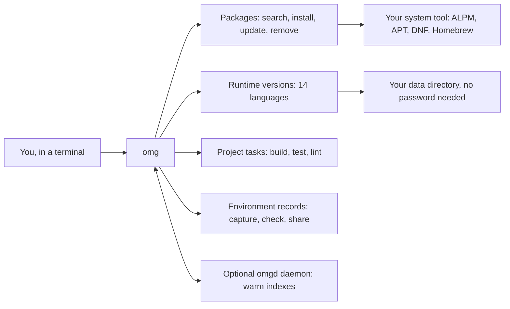
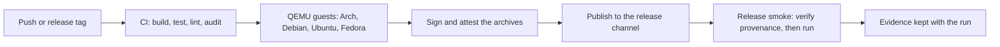

<div align="center">

# OMG

**One command line for system packages, language runtimes, and project tasks — on Linux, Apple silicon macOS, and WSL.**

[](https://github.com/omg-cli/omg/actions/workflows/ci.yml)
[](https://github.com/omg-cli/omg/releases/latest)
[](LICENSE)
[](rust-toolchain.toml)
[](https://getomg.xyz/docs)
[](https://getomg.xyz)

[Install](#install-in-one-step) · [First five commands](#first-five-commands) · [Why OMG](#why-omg) · [What it does](#what-it-does) · [Security](#security-built-into-installation) · [Limits](#what-omg-does-not-do) · [Docs](https://getomg.xyz/docs)

</div>

> [!IMPORTANT]
> **Beta.** Command surfaces, configuration keys, and on-disk formats can still change. Keep
> `pacman`, `apt`, `dnf`, or `brew` installed, and validate package changes on a machine you can
> reinstall.

## Why OMG

- **Stop switching tools.** Search, install, update, and remove packages; choose a language
  version per project; run the build and test tasks a project already defines — one CLI instead
  of four, and the same commands across every supported system.
- **Your system's package manager still does the work.** OMG drives ALPM, APT, DNF, or Homebrew
  rather than replacing it, so everything you install stays maintainable by the tools you already
  trust.
- **Checks where the risk is.** Downloads are verified, managed tools install with lifecycle
  scripts disabled by default, AUR recipes are reviewed and built in an offline sandbox, and every
  mutation can be inspected afterwards in history.
- **Free, open source, no account.** MIT licensed, with no account required for local use and
  telemetry off by default.

## Who it is for

- **Arch users** who want AUR installs with source review, an offline Bubblewrap build, and archive
  inspection by default — without giving up `pacman`.
- **Polyglot developers** who need Node, Python, Go, Rust, and friends pinned per project instead of
  per machine.
- **Teams** who want a recorded environment (`omg.lock`) that a colleague or a CI job can compare
  against, and drift reported rather than guessed at.
- **Anyone running several of these at once**, on a laptop, a desktop, or a disposable VM.

## Install in one step

You need `curl`, a supported system, and the GitHub CLI (`gh`) for the build-provenance check. The
installer verifies the archive before anything is copied, and stops if verification fails.

```bash
curl --proto '=https' --tlsv1.2 -fsSL https://getomg.xyz/install.sh -o omg-install.sh
less omg-install.sh                                      # read it first
OMG_NO_TELEMETRY=1 OMG_SKIP_SHELL=1 bash omg-install.sh  # no telemetry, no shell edits
export PATH="$HOME/.local/bin:$PATH"                     # this window only
omg --version
```

Then, once, to finish the setup on your terms:

```bash
omg init          # asks before it changes anything: shell hook, daemon, first capture
```

| Your system | Backend | Notes |
| :--- | :--- | :--- |
| Arch Linux, x86_64 | ALPM + AUR | Widest coverage: AUR review, offline builds, policy, rollback |
| Debian or Ubuntu, x86_64 | APT | Native APT operations; no AUR |
| Fedora, x86_64 | DNF / RPM | Experimental backend, exercised in QEMU |
| Apple silicon macOS | Homebrew | Published as ARM64; Intel macOS is not supported |
| Windows | via WSL | Install a supported Linux distribution in WSL; there is no native Windows build |

<details>
<summary><strong>Other install paths</strong> (AUR, source build, updating, uninstalling)</summary>

```bash
# Arch, from a source checkout with the matching recipe (third-party packaging: check it first)
yay -S omg-bin

# Any supported system: build from a reviewed checkout, one backend at a time
cargo build --release --locked --no-default-features --features arch,pgp,license   # also: debian, fedora, macos
bash ./install.sh --from-source

# Update an existing installation (both binaries, from one verified archive)
omg self-update
```

- Coming from **v0.1.222**? Run `omg self-update`, then `omg self-update --force` once so the daemon is replaced too.
- Coming from **v0.1.221 or earlier**, follow the [signing-repository migration](docs/releases/v0.1.222.md) first.
- A package-managed installation (for example an AUR package someone else maintains) updates and uninstalls through that package manager, not through `omg self-update`. This repository does not guarantee that such a package exists or matches a release; check what you install.
- Uninstall a script installation with the installer's `--uninstall` mode. It backs up each shell file it edits and leaves your data in `~/.local/share/omg` alone.
- `OMG_VERSION=v0.1.223`, `INSTALL_DIR="$HOME/.omg/bin"`, `OMG_NO_TELEMETRY=1`, and `OMG_SKIP_SHELL=1` are read from the environment when the installer runs. Full procedure: [installation](docs/installation.md).

</details>

## First five commands

Nothing here changes your system until the fourth line, and that one asks you to confirm first.

```bash
omg --help                      # what exists (--all-commands adds the advanced surface)
omg search ripgrep              # find a package; on Arch this includes the AUR
omg install --dry-run ripgrep   # read the plan, change nothing
omg install ripgrep             # install it
omg doctor                      # confirm the machine is healthy (exit 0 healthy, exit 1 issues)
```

Then, in a project you trust:

```bash
omg use node 22                 # select a runtime version for this project
omg run build                   # run the task the project already defines
omg env capture                 # record the environment in omg.lock
omg env check                   # report drift against that record
```


**Not for you if** you want a graphical package manager, a compliance certification tool, a Nix-style
fully declarative system, or a replacement for your distribution's package manager. OMG is a
terminal tool that wraps what you already have.


### What each flag actually does

```bash
# Search lanes. On Arch, official repositories and the AUR are queried concurrently.
omg search ripgrep --no-aur         # skip the network-backed AUR lane entirely
omg search ripgrep --detailed       # add source metadata such as votes and popularity
omg search ripgrep --limit 50       # raise the result cap (default 15)

# Mutations. Every one of these accepts a preview flag; none of them is a safety verdict.
omg install ripgrep --dry-run       # print the planned transaction, change nothing
omg remove ripgrep --recursive      # Arch only: also remove dependencies nothing else needs
omg update --check                  # list what would be updated, change nothing
omg update --aur-only               # Arch only: refresh AUR packages, leave official upgrades to pacman -Syu
omg clean --cache --dry-run         # show what cache cleanup would delete

# Runtimes. Versions install inside your home folder; no password is involved.
omg use python 3.12                 # install if missing, then select it
omg use python 3.11                 # switch between installed versions at any time
omg use python 3.11 --uninstall     # remove a version (switch away from it first)
omg list node --available           # include versions you could download, not just installed ones

# Records and diagnosis.
omg env check                       # exit status 1 means this machine drifted from omg.lock
omg history --type update           # filter recorded transactions by kind
omg rollback <transaction-id>       # return to an earlier recorded version, where supported
omg daemon --foreground             # run the optional helper in this terminal to read its output
```

## How it works

Two programs ship together. The CLI does the work; the daemon only keeps derived state warm, so a
package operation never depends on it being up.

| Component | Role | Without it |
| :--- | :--- | :--- |
| `omg` | Arguments, backend queries and mutations, policy, output, task runner, prompt counters | Nothing runs — this is the program you use |
| `omgd` | Warm in-memory index, background status refresh, status snapshots | Package commands take direct backend paths; scans, Unix SOC 2 export, and metrics need it |
| Backend | ALPM + AUR, APT, DNF/RPM, or Homebrew | No package operations; runtimes, tasks, and records still work |
| `omg.status` | Fixed 32-byte snapshot read by `omg ec`, `tc`, `oc`, `uc` | Prompt counters fall back to the slower CLI path |

**[Under the hood](docs/under-the-hood.md)** explains the rest with the details that matter when
something goes wrong: socket resolution and message framing, the three cache tiers and their
freshness rules, when a subprocess fallback is used instead of a native library, the five AUR gates
and what each blocks, what a lockfile fingerprint actually hashes, how the audit chain is built, and
why rollback is not a snapshot.

## What it does



| You want to | Run | Notes |
| :--- | :--- | :--- |
| Find and inspect a package | `omg search`, `omg info`, `omg why` | AUR results on Arch unless `--no-aur` |
| Change packages safely | `omg install`, `omg remove`, `omg update`, `omg clean` | Every one accepts a preview flag |
| Choose a runtime version | `omg use`, `omg list`, `omg which` | Installs inside your home folder |
| Run the project's tasks | `omg run build`, `omg run test` | Detects `package.json`, `Cargo.toml`, `Makefile`, more |
| Install developer tools | `omg tool install prettier` | Managed policies: scripts off, signatures checked |
| Record an environment | `omg env capture`, `omg env check` | Writes `omg.lock`; needs an Arch or Debian backend |
| Watch the system | `omg dash`, `omg status`, `omg metrics` | `dash` is a full-screen terminal dashboard |
| Keep indexes warm | `omg daemon`, `omg daemon-status` | Optional; every package command works without it |
| Audit what happened | `omg history`, `omg rollback`, `omg audit` | Limits are documented, not glossed over |

**Runtime managers (14):** Node.js, Python, Go, Rust, Ruby, Java, Bun, Pi, Deno, Zig, .NET, Erlang,
PHP, Swift — plus 54 registry developer tools. Shell hooks for Bash, Zsh, and Fish read project pins
such as `.nvmrc` automatically; the hook is optional.

**Already using mise?** Supported version pins, environment layers, task dependencies, and project
environments are reused. See [mise compatibility](docs/mise-compatibility.md) for the exact boundaries.

*New to the terminal?* Start with [Getting started](docs/getting-started.md) and keep

### What each flag actually does

## Backend coverage in detail

| System | Backend | Covered | Not covered |
| :--- | :--- | :--- | :--- |
| Arch Linux | ALPM + AUR | Search, install, update, remove, policy, transaction history, rollback, AUR review and sandboxed builds | AUR entries are community recipes, not publisher-verified packages |
| Debian, Ubuntu | Native APT | Search, install, update, remove, history, environment capture | No AUR; audit and policy coverage differs from Arch |
| Fedora | DNF / RPM | RPM database reads and DNF-backed operations | Experimental; Fedora evidence does not establish RHEL compatibility, and environment capture refuses explicitly |
| Apple silicon macOS | Homebrew | Homebrew-backed package operations | No AUR, no Linux advisory matching; published as ARM64 only |
| Windows | via WSL | Whatever the guest Linux distribution supports | No native backend; WSL is not a QEMU-tested guest |

Building one backend from a reviewed checkout:

```bash
cargo build --release --locked --no-default-features --features arch,pgp,license   # also: debian, fedora, macos
```

An available backend does not imply identical command, audit, or runtime coverage. Full procedure:
[installation](docs/installation.md).

## Security built into installation

OMG applies checks at download, build, activation, and privileged installation boundaries.

| Boundary | What happens |
| :--- | :--- |
| Downloads | Runtime installers verify the checksum or signature they expect and refuse a download that lacks required integrity evidence. Release archives are checked against a published digest and a GitHub build attestation. |
| Managed npm tools | `omg tool install` stages the package with lifecycle scripts disabled and runs npm signature verification before activation. Running scripts needs an explicit package-scoped exception. |
| Managed Python, Cargo, and Go tools | Python tools get a dedicated virtual environment and wheels by default. Cargo installs request `--locked`. Go installs disable CGO and automatic toolchain downloads and set checksum and proxy policy. |
| AUR recipes | Source review is on by default, the source manifest is rechecked before execution, and builds run in Bubblewrap with an isolated home, a cleared environment, and no build network. |
| AUR output | Bounded archive inspection checks paths, metadata, links, and privileged contents before installation. Install hooks, capabilities, and setuid/setgid files need explicit, attended approval. |
| High-risk AUR packages | Packages with privileged or system-integration contents require matching output from a second private build; approval is bound to the inspected archive hashes. |
| Privilege handoffs | Privileged subprocesses use trusted executable paths with dangerous environment settings scrubbed, and accepted AUR bytes are passed sealed. |

Run OMG as your regular user: it asks for elevation when a package mutation needs it, refuses root
for AUR builds, and never asks you to run the whole tool as root to work around a failure.

Read [AUR policy](docs/aur.md) and the [security model](docs/security.md) for exact scope and
opt-ins.

## What OMG does not do

The point of a tool like this is knowing where it stops.

- **Not a compliance product.** No SOC 2, ISO 27001, HIPAA, PCI DSS, or FedRAMP certification is
  implied. `omg audit export` writes plaintext evidence for a human reviewer; the HIPAA export is
  not implemented.
- **Audit evidence has stated limits.** `omg audit sbom` matches Arch Linux advisories and does not
  build full transitive graphs for Debian or macOS. `omg audit slsa` verifies a supported artifact
  signature, not a SLSA build level. `omg audit verify` proves the local hash chain was not edited,
  not who wrote it.
- **No promised speedups.** Some repeated queries get faster from warm caches. Nothing more is
  claimed, and the recorded runs, hosts, and cache states are published in
  [the benchmark methodology](benchmarks/README.md).
- **It does not rebuild machines.** `omg env capture` records inventory, `omg env share` uploads it,
  and `omg env sync` downloads one and reports drift. None of them installs software. Capture needs
  an Arch or Debian backend.
- **Rollback is not a snapshot.** `omg rollback` returns to a recorded transaction when the backend,
  the retained package versions, and your current dependencies allow it.
- **It does not run everywhere.** Release targets are Linux x86_64 (Arch, Debian, Ubuntu, Fedora)
  and Apple silicon macOS. Intel macOS, Linux ARM64, and native Windows have no published release.


```bash
# Search lanes. On Arch, official repositories and the AUR are queried concurrently.
omg search ripgrep --no-aur         # skip the network-backed AUR lane entirely
omg search ripgrep --detailed       # add source metadata such as votes and popularity
omg search ripgrep --limit 50       # raise the result cap (default 15)

# Mutations. Every one of these accepts a preview flag; none of them is a safety verdict.
omg install ripgrep --dry-run       # print the planned transaction, change nothing
omg remove ripgrep --recursive      # Arch only: also remove dependencies nothing else needs
omg update --check                  # list what would be updated, change nothing
omg update --aur-only               # Arch only: refresh AUR packages, leave official upgrades to pacman -Syu

## How releases are produced

Every published archive is built by the release workflow from the tagged commit and carries an
attestation bound to that tag and workflow. Before publication the commit must pass CI, benchmarks,
security audit, secret scanning, CodeQL, coverage, Docker end-to-end tests, and staged QEMU runs;
after publication, published-archive QEMU re-verifies provenance and exercises daemon lifecycle in
all four Linux guests. A green run is evidence for what it tested, not proof of every command path —
[CI security controls](docs/ci-security-controls.md) and [QEMU evidence](docs/qemu-local.md) show the
current gates.

## Documentation

| Start here | Go deeper |
| :--- | :--- |
| [Getting started](docs/getting-started.md) — assumes no terminal experience | [Under the hood](docs/under-the-hood.md) — caches, IPC, AUR gates, audit chain |
| [Installation](docs/installation.md) — downloads, attestation, removal | [Architecture](docs/architecture.md) — components and data flow |
| [Quickstart](docs/quickstart.md) — a project in four commands | [Security](docs/security.md) — evidence and its limits |
| [Cheat sheet](docs/cheatsheet.md) — everyday commands | [Troubleshooting](docs/troubleshooting.md) — safe diagnosis |
| [Glossary](docs/glossary.md) — every term in plain words | [Performance](docs/performance-tips.md) · [Task runner](docs/task-runner.md) · [AUR](docs/aur.md) |

The same topics are curated for the web at **[getomg.xyz/docs](https://getomg.xyz/docs)**.

## Contributing

Contributions are welcome. [CONTRIBUTING.md](CONTRIBUTING.md) covers code standards, the QEMU
multi-distribution test environments, and how to run the checks locally.

- **Bugs and ideas:** [GitHub Issues](https://github.com/omg-cli/omg/issues) — include
  `omg --version`, your distribution, and the command output.
- **Security reports:** privately, as described in [SECURITY.md](SECURITY.md).

## License

MIT — see [LICENSE](LICENSE). Copyright © 2024–2026 Olen Latham.

omg clean --cache --dry-run         # show what cache cleanup would delete

## How releases are produced



Every published archive is built by the release workflow from the tagged commit and carries an
attestation bound to that tag and workflow. Before publication, the exact commit must pass CI,
benchmarks, security audit, secret scanning, CodeQL, coverage, Docker end-to-end tests, and staged
QEMU runs. After publication, published-archive QEMU re-verifies provenance and runs the binaries
users download — including daemon startup, IPC, singleton protection, shutdown, and restart in all
four Linux guests. [v0.1.223 passed all four](https://github.com/omg-cli/omg/actions/runs/35096706309).
Details: [CI security controls](docs/ci-security-controls.md) and
[QEMU usage and evidence](docs/qemu-local.md).

### What each gate proves

| Gate | Proves | Does not prove |
| :--- | :--- | :--- |
| CI build, test, lint, coverage | The commit compiles and its test inventory passes on the runner | Behaviour on a distribution the runner is not |
| Benchmarks | No regression beyond the recorded tolerance for the measured operations | Speed on your hardware, your cache state, or your repository set |
| Security audit, secret scan, CodeQL | The checked classes of defect were not found by these tools | Absence of every defect class |
| Staged QEMU (Arch, Debian, Ubuntu, Fedora) | The reviewed CLI inventory and daemon lifecycle work in clean guests | Your configured machine, your repositories, your AUR recipes |
| Signed and attested archives | The bytes came from this workflow at this tag | That installing a package afterwards is safe |
| Published-archive smoke | The artifact users download runs and reports its provenance | Long-running stability or every command combination |

Evidence for a run is retained with the run, and a failure on a trusted push, manual, or scheduled run
can open an issue with the case, exit status, commit, job, and evidence link. A published release can
be withdrawn with `scripts/r2-rollback.sh` if a problem is found after it ships. See
[release operations](docs/release-operations.md) for the full sequence.

## Recent changes

**[v0.1.223](https://github.com/omg-cli/omg/releases/tag/v0.1.223)** tightens the daemon and update paths:

- The CLI and daemon ship as one unit: every Linux and macOS archive contains `omg` and `omgd`, and the self-updater installs both from the same verified archive with staging and recovery.
- Daemon lifecycle is verified in Arch, Debian, Ubuntu, and Fedora QEMU guests, with native APT access serialized.
- Update notices appear after successful interactive commands at most once a day, and never install anything. `OMG_NO_UPDATE_CHECK=1` turns them off.
- mise projects reuse supported pins, environment layers, and task dependencies.

[Release notes](docs/releases/v0.1.223.md) · [Full changelog](docs/changelog.md)

## Documentation

| Start here | Go deeper |
| :--- | :--- |
| [Getting started](docs/getting-started.md) — assumes no terminal experience | [Under the hood](docs/under-the-hood.md) — how the parts actually work |
| [Installation](docs/installation.md) — downloads, attestation, removal | [Architecture](docs/architecture.md) — CLI, daemon, IPC, caches |
| [Quickstart](docs/quickstart.md) — a project in four commands | [Security](docs/security.md) — evidence and its limits |
| [Cheat sheet](docs/cheatsheet.md) — one page of everyday commands | [Troubleshooting](docs/troubleshooting.md) — safe diagnosis |
| [Glossary](docs/glossary.md) — every term in plain words | [Task runner](docs/task-runner.md) · [Runtimes](docs/runtimes.md) · [AUR](docs/aur.md) |

The same topics are curated for the web at **[getomg.xyz/docs](https://getomg.xyz/docs)**.

## Contributing

Contributions are welcome. [CONTRIBUTING.md](CONTRIBUTING.md) covers code standards, the QEMU
multi-distribution test environments, and how to run the checks locally.

- **Bugs and ideas:** [GitHub Issues](https://github.com/omg-cli/omg/issues) — include `omg --version`, your distribution, and the command output.
- **Security reports:** privately, as described in [SECURITY.md](SECURITY.md).

## License

MIT — see [LICENSE](LICENSE). Copyright © 2024–2026 Olen Latham.


# Runtimes. Versions install inside your home folder; no password is involved.
omg use python 3.12                 # install if missing, then select it
omg use python 3.11 --uninstall     # remove a version (switch away from it first)
omg list node --available           # include versions you could download, not just installed ones

# Records and diagnosis.
omg env check                       # exit status 1 means this machine drifted from omg.lock
omg history --type update           # filter recorded transactions by kind
omg rollback <transaction-id>       # return to an earlier recorded version, where supported
omg daemon --foreground             # run the optional helper in this terminal to read its output
```


## Backend coverage in detail

| System | Backend | Covered | Not covered |
| :--- | :--- | :--- | :--- |
| Arch Linux | ALPM + AUR | Search, install, update, remove, policy, transaction history, rollback, AUR review and sandboxed builds | Nothing Arch-specific applies on other systems; AUR entries are community recipes, not publisher-verified packages |
| Debian, Ubuntu | Native APT | Search, install, update, remove, history, environment capture | No AUR; audit and policy coverage differs from Arch |
| Fedora | DNF / RPM | RPM database reads and DNF-backed operations | Experimental; Fedora evidence does not establish RHEL compatibility, and environment capture refuses explicitly |
| Apple silicon macOS | Homebrew | Homebrew-backed package operations | No AUR, no Linux advisory matching; published as ARM64 only |
| Windows | via WSL | Whatever the guest Linux distribution supports | No native backend; WSL is not a QEMU-tested guest |

Building a specific backend from a reviewed checkout (one backend per build):

```bash
cargo build --release --locked --no-default-features --features arch,pgp,license
cargo build --release --locked --no-default-features --features debian,pgp,license
cargo build --release --locked --no-default-features --features fedora,pgp,license
cargo build --release --locked --no-default-features --features macos,pgp,license
```

An available backend does not imply identical command, audit, or runtime coverage. Runtime managers
have their own host limits, so a package backend working on a system does not promise that every
runtime installs there.

## Security built into installation

OMG puts checks where the risk is, and says plainly where they stop.

| Boundary | What happens |
| :--- | :--- |
| **Downloads** | Runtime installers verify the checksum or signature they expect, and refuse a download that lacks required integrity evidence. Release archives are checked against a published digest and a GitHub build attestation. |
| **Managed npm tools** | `omg tool install` stages the package with lifecycle scripts disabled and runs npm signature verification before activation. Running scripts, or installing in an environment without signing support, needs an explicit package-scoped exception. |
| **Managed Python, Cargo, and Go tools** | Python tools get a dedicated virtual environment and wheels by default. Cargo installs request `--locked`. Go installs disable CGO and automatic toolchain downloads and set checksum and proxy policy. |
| **AUR recipes** | Source review is on by default, the source manifest is rechecked before execution, and builds run in Bubblewrap with an isolated home, a cleared environment, and no build network. |
| **AUR output** | Bounded archive inspection checks paths, metadata, links, and privileged contents before installation. Install hooks, capabilities, and setuid/setgid files need your explicit, attended approval. |
| **High-risk AUR packages** | Selected packages with privileged or system-integration contents require matching output from a second, private build, and approval is bound to the inspected archive hashes. |
| **Privilege and file handoffs** | Privileged subprocesses use trusted executable paths with dangerous environment settings scrubbed. Sealed AUR archives, ownership checks, anchored file operations, and exact-destination replacement protect the last step. |

Run OMG as your regular user: it asks for elevation when a package mutation needs it, refuses root
for AUR builds, and never asks you to run the whole tool as root to work around a failure.

These controls reduce specific risks. They do not make community code benign, and they do not cover
a separately invoked `npm install` or an unsandboxed project task. Read [AUR policy](docs/aur.md) and
the [security model](docs/security.md) for the exact scope and opt-ins.

## What OMG does not do

The point of a tool like this is knowing where it stops.

- **It is not a compliance product.** No SOC 2, ISO 27001, HIPAA, PCI DSS, or FedRAMP certification
  is implied. `omg audit export` writes plaintext evidence for a human reviewer; the HIPAA export is
  not implemented.
- **Its audit evidence has stated limits.** `omg audit sbom` matches Arch Linux advisories and does
  not build full transitive application graphs for Debian or macOS. `omg audit slsa` verifies a
  supported artifact signature, not a SLSA build level. `omg audit verify` proves the local hash
  chain was not edited, not who wrote it.
- **It does not promise speedups.** Some repeated queries get faster from warm caches. Nothing more is
  claimed, and the recorded runs, hosts, and cache states are published in
  [the benchmark methodology](benchmarks/README.md).
- **It does not rebuild machines.** `omg env capture` records inventory, `omg env share` uploads that
  record, and `omg env sync` downloads one and reports drift. None of them installs software or
  recreates an identical machine. Environment capture needs an Arch or Debian backend; Fedora refuses
  it explicitly.
- **Rollback is not a snapshot.** `omg rollback` returns to a recorded transaction when the backend,
  the retained package versions, and your current dependencies allow it.
- **It does not run everywhere.** Release targets are Linux x86_64 (Arch, Debian, Ubuntu, Fedora) and
  Apple silicon macOS. Intel macOS, Linux ARM64, and native Windows have no published release;
  Windows use goes through WSL. Fedora support does not imply RHEL support.

## How it works

Two programs ship together. The CLI does the work; the daemon only keeps derived state warm, so a
package operation never depends on it being up.

| Component | Role | Without it |
| :--- | :--- | :--- |
| `omg` | Arguments, backend queries and mutations, policy, output, task runner, prompt counters | Nothing runs — this is the program you use |
| `omgd` | Warm in-memory index, background status refresh, status snapshots | Package commands take direct backend paths; scans, Unix SOC 2 export, and metrics need it |
| Backend | ALPM + AUR, APT, DNF/RPM, or Homebrew | No package operations; runtimes, tasks, and records still work |
| `omg.status` | Fixed 32-byte snapshot read by `omg ec`, `tc`, `oc`, `uc` | Prompt counters fall back to the slower CLI path |

**[Under the hood](docs/under-the-hood.md)** explains the rest with the detail that matters when
something goes wrong: socket resolution and message framing, the three cache tiers and their
freshness rules, when a subprocess fallback is used instead of a native library, the five AUR gates
and what each blocks, what a lockfile fingerprint actually hashes, how the audit chain is built, and
why rollback is not a snapshot.

## What it does


| You want to | Run | Notes |
| :--- | :--- | :--- |
| Find and inspect a package | `omg search`, `omg info`, `omg why` | AUR results on Arch unless `--no-aur` |
| Change packages safely | `omg install`, `omg remove`, `omg update`, `omg clean` | Every one accepts a preview flag |
| Choose a runtime version | `omg use`, `omg list`, `omg which` | Installs inside your home folder |
| Run the project's tasks | `omg run build`, `omg run test` | Detects `package.json`, `Cargo.toml`, `Makefile`, more |
| Install developer tools | `omg tool install prettier` | Managed policies: scripts off, signatures checked |
| Record an environment | `omg env capture`, `omg env check` | Writes `omg.lock`; needs an Arch or Debian backend |
| Watch the system | `omg dash`, `omg status`, `omg metrics` | `dash` is a full-screen terminal dashboard |
| Keep indexes warm | `omg daemon`, `omg daemon-status` | Optional; every package command works without it |
| Audit what happened | `omg history`, `omg rollback`, `omg audit` | Limits are documented, not glossed over |

**Runtime managers (14):** Node.js, Python, Go, Rust, Ruby, Java, Bun, Pi, Deno, Zig, .NET, Erlang,
PHP, Swift — plus 54 registry developer tools. Shell hooks for Bash, Zsh, and Fish read project
pins such as `.nvmrc` automatically; the hook is optional.

**Already using mise or yay?** Supported mise pins, environment layers, and task dependencies are
reused ([compatibility notes](docs/mise-compatibility.md)), and the [yay migration guide](docs/migration/from-yay.md)
maps the commands you already know while stating what does not map.

[the glossary](docs/glossary.md) nearby.
