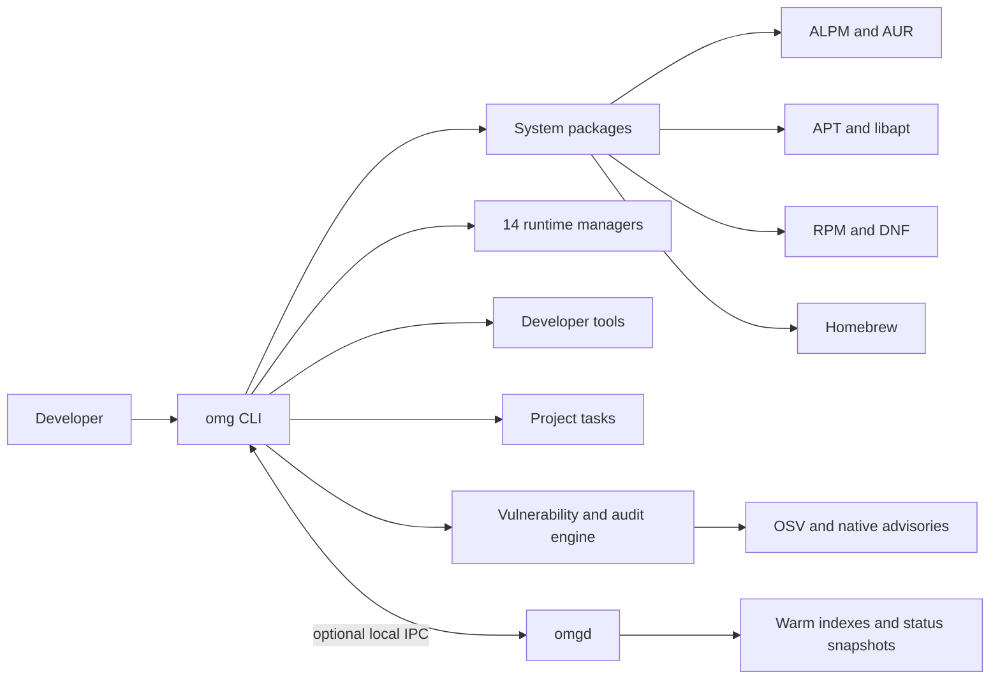

<div align="center">

# OMG

**Packages. Runtimes. Security. One command.**

OMG brings system packages, language runtimes, developer tools, project tasks, and
vulnerability evidence into one Rust CLI. It gives Arch, Debian, Ubuntu, Fedora,
and Apple silicon macOS one consistent, security-first workflow without making you
assemble a different toolchain on every machine.

[](https://github.com/omg-cli/omg/actions/workflows/ci.yml)
[](https://github.com/omg-cli/omg/releases/latest)
[](LICENSE)
[](https://getomg.xyz/docs)

[Install](#install) · [Why OMG](#why-omg) · [Security](#security-is-part-of-the-workflow) · [Platforms](#supported-platforms) · [Docs](https://getomg.xyz/docs)

</div>

```bash
omg search ripgrep              # one search command on every supported system
omg install ripgrep --dry-run   # inspect the package plan before changing anything
omg use node 24                 # install and select a project runtime
omg run test                    # run the task this project already defines
omg audit scan                  # fetch advisories and show vulnerability evidence
```

The daemon is optional for package operations. It keeps package indexes, vulnerability
results, and status snapshots warm. In published v0.1.223, `omg audit scan`
requires `omgd`; the current main checkout adds direct scanning when the daemon is absent.

## Why OMG

| | What you get |
| :--- | :--- |
| **One workflow across systems** | Use the same commands on Arch, Debian, Ubuntu, Fedora, macOS, and supported Linux distributions inside WSL. |
| **Security during the operation** | Verify downloads, constrain developer-tool installers, review and sandbox AUR builds, inspect produced archives, and record mutations as they happen. |
| **The whole development environment** | Manage system packages, 14 native runtime managers, 54 curated developer tools, project tasks, environment records, and security evidence from one CLI. |
| **Fast paths without a hard daemon dependency** | Read ALPM, APT, and RPM state in process where supported. Run `omgd` for warm caches and background refreshes, or leave it off. |
| **Evidence instead of promises** | CI exercises real Linux guests through QEMU, preserves per-command receipts, and files detailed issues when a gate fails. Benchmark claims require comparable recorded work. |

OMG is written in Rust and distributed under the MIT license. Local use needs no
account, and telemetry is off by default.

## More than a package-manager wrapper

OMG uses the package data and transaction boundary appropriate to each platform:
direct `libalpm` access on Arch, APT database and `libapt` integration on Debian
and Ubuntu, direct RPM database reads plus guarded DNF operations on Fedora, and
a policy-gated Homebrew path on macOS. AUR support is implemented as its own
review, dependency, sandbox, and archive-inspection pipeline.

| Job | Commands | What OMG adds |
| :--- | :--- | :--- |
| Find and change packages | `search`, `info`, `why`, `install`, `remove`, `update`, `clean` | One interface, previews, backend-aware policy, history |
| Use the AUR | `search`, `install`, `update` | Source review, offline Bubblewrap builds, output inspection, attended approval for privileged content |
| Manage runtimes | `use`, `list`, `which`, `use --uninstall` | Native managers for Node.js, Python, Go, Rust, Ruby, Java, Bun, Pi, Deno, Zig, .NET, Erlang, PHP, and Swift |
| Install developer tools | `tool search`, `tool install`, `tool list` | Curated registry and ecosystem-specific install policy for npm, Python, Cargo, Go, and system packages |
| Run project tasks | `run` | Detects the task system the project already uses and forwards arguments |
| Record environment intent | `env capture`, `env check`, `env share`, `env sync` | Inventory, portable intent, and drift reporting without pretending to rebuild the machine |
| Inspect security | `audit scan`, `audit sbom`, `audit policy`, `audit verify` | OSV and native advisory evidence, CycloneDX output, local policy, hash-chain verification |
| Operate and investigate | `status`, `doctor`, `dash`, `history`, `rollback` | Health checks, terminal dashboard, transaction records, and bounded rollback |

## Security is part of the workflow

Security checks sit on the path to installation and activation instead of living
only in a separate report.

| Boundary | OMG behavior |
| :--- | :--- |
| **OMG releases** | The installer verifies the release digest and GitHub build attestation before copying binaries. Self-update replaces `omg` and `omgd` from the same verified archive. |
| **Runtime downloads** | Each provider's available checksum or signature policy is applied before extraction. Staging is bounded, path-safe, and published only after validation. |
| **Developer tools** | npm lifecycle scripts are disabled by default and signatures are checked; Python tools use isolated environments and wheels by default; Cargo requests locked installs; Go disables automatic toolchain downloads and CGO. |
| **AUR source** | Recipes and source declarations are reviewed before execution. Builds use Bubblewrap with an isolated home, a cleared environment, and no network by default. |
| **AUR output** | Archive paths, links, metadata, hooks, capabilities, and setuid/setgid files are inspected. High-risk output requires explicit approval bound to the inspected archive. |
| **Vulnerability evidence** | Direct and daemon-backed scans share the same inventory and scoring code. OMG preserves published CVSS or advisory severity and does not invent a numeric score when upstream provides none. |
| **Audit history** | Mutations produce local records protected by a hash chain. Verification detects tampering; it does not claim an external identity or compliance certification. |
| **Privilege changes** | OMG runs as the regular user and requests elevation only for the package mutation that needs it. Privileged state uses administrator-controlled paths. |

Read the [security model](docs/security.md), [AUR policy](docs/aur.md), and
[documented trust boundaries](SECURITY.md) for the exact guarantees and limits.

## How it fits together



`omg` remains the product entry point and owns direct execution. `omgd` keeps
derived state warm and serves the same shared security engine over local Unix IPC.
Stopping the daemon does not disable ordinary package operations. In published
v0.1.223, `omg audit scan` still needs `omgd`; the main checkout can scan directly.

## Install

The installer requires `curl` and the GitHub CLI (`gh`). It downloads the correct
release pair, verifies its digest and build provenance, and then installs into your
home directory.

```bash
curl --proto '=https' --tlsv1.2 -fsSL https://getomg.xyz/install.sh -o omg-install.sh
less omg-install.sh
OMG_NO_TELEMETRY=1 OMG_SKIP_SHELL=1 bash omg-install.sh
export PATH="$HOME/.local/bin:$PATH"
omg --version
```

Then choose the setup you want:

```bash
omg init
```

In an interactive terminal, `omg init` asks before setting up shell integration,
the optional daemon, or an initial environment record. In a non-interactive
terminal it uses defaults, so review its options first. See
[installation](docs/installation.md) for source builds, custom paths, updating,
and uninstalling.

## Supported platforms

| Platform | Package path | Release status |
| :--- | :--- | :--- |
| Arch Linux x86_64 | ALPM plus first-class AUR pipeline | Supported; broadest package-security coverage |
| Debian 12 / Ubuntu 24.04 x86_64 | APT 6 database | Supported by published v0.1.223 release binaries |
| Debian 13 / Ubuntu 26.04 x86_64 | APT 7 database | Current main checkout supports the Trixie archive mapping; v0.1.223 has no APT 7 artifact |
| Fedora x86_64 | Direct RPM state plus DNF repository operations | Experimental |
| Apple silicon macOS | Policy-gated Homebrew integration | Supported on ARM64 |
| Windows | A supported Linux distribution in WSL | No native Windows build |

Published releases do not currently target Intel macOS or Linux ARM64. Backend
availability also does not imply identical policy, audit, or rollback coverage;
the [installation matrix](docs/installation.md) and [security model](docs/security.md)
state the differences.

## Start using it

```bash
# Read-only discovery
omg --help
omg search ripgrep
omg info ripgrep
omg doctor

# Preview first, then apply
omg install ripgrep --dry-run
omg install ripgrep

# Enter a project
omg use python 3.13
omg run test

# Inspect the machine
omg audit scan
omg audit sbom                  # Arch system-package inventory
omg history
```

Useful next reads:

- [Getting started](docs/getting-started.md) — a guided first session.
- [Quickstart](docs/quickstart.md) — runtimes and tasks in an existing project.
- [Cheat sheet](docs/cheatsheet.md) — everyday commands on one page.
- [Under the hood](docs/under-the-hood.md) — backends, caches, IPC, AUR gates, and the audit chain.
- [CLI reference](docs/cli.md) — the complete command surface.
- [Troubleshooting](docs/troubleshooting.md) — safe diagnosis and recovery.

## Tested like a system tool

The release gate checks more than parser acceptance. It builds backend-specific
`omg`/`omgd` pairs, runs unit and integration suites, scans dependencies and
workflows, exercises containers, and boots Arch, Debian, Ubuntu, and Fedora guests
under QEMU. Guest inventory rows retain stdout, stderr, exit status, prerequisites,
and completion receipts. Trusted main-branch failures can open detailed GitHub
issues automatically so the failure remains part of the project history.

The gate is intentionally evidence-bound: a skipped command is not coverage, a
retry does not erase the first failure, and a green run proves only the behavior it
actually exercised. See [QEMU evidence](docs/qemu-local.md) and
[CI security controls](docs/ci-security-controls.md).

## Release status

OMG is approaching beta. The latest published release predates beta, and command
surfaces, configuration keys, and on-disk formats may change. Keep the native
package tool available as a recovery path. See [security](docs/security.md) and
[release readiness](docs/release-readiness.md) for current guarantees and limits.

## Contributing

Contributions are welcome. [CONTRIBUTING.md](CONTRIBUTING.md) explains the coding
standards, local checks, and QEMU environments.

- Report bugs and feature ideas through [GitHub Issues](https://github.com/omg-cli/omg/issues).
- Report vulnerabilities privately as described in [SECURITY.md](SECURITY.md).

## License

MIT — see [LICENSE](LICENSE). Copyright © 2024–2026 Olen Latham.
