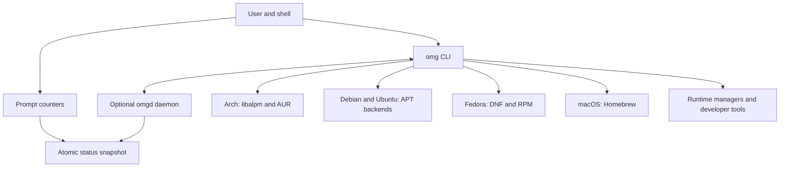

# OMG

<div align="center">

[](https://github.com/omg-cli/omg/actions/workflows/ci.yml)
[](https://github.com/omg-cli/omg/releases/latest)
[](LICENSE)
[](https://getomg.xyz)
[](https://getomg.xyz/docs)
[](rust-toolchain.toml)

**Packages and runtimes. One workflow. Built-in security checks.**

*Packages. Runtime versions. Project tasks. Declarative environment records.*  
*A Rust CLI for managing your development stack, with verification and controlled privilege elevation built into installation.*

[Website](https://getomg.xyz) · [Documentation](https://getomg.xyz/docs) · [Quickstart](docs/quickstart.md) · [Installation](docs/installation.md) · [CLI Reference](docs/cli.md) · [Security Updates](https://getomg.xyz/security/) · [Report Issue](https://github.com/omg-cli/omg/issues)

</div>

---

> [!IMPORTANT]
> **Alpha Development Notice**: OMG is under active alpha development. Command surfaces, configuration flags, and on-disk formats may evolve. Always test package mutations on disposable VMs or recoverable developer machines. Keep native package tools (`pacman`, `apt`, `dnf`, `brew`) available.

---

## Why OMG?

OMG brings system packages, language runtimes, and project tasks into one CLI. Use the same commands across supported platforms while keeping access to their native package tools.

The value is in the installation workflow: verification before activation, safer defaults for managed developer tools, and evidence you can inspect. You do not have to assemble those controls separately for each supported ecosystem.

| What you need | OMG workflow |
| :--- | :--- |
| **System packages** | `omg search` · `omg install` · `omg update` · `omg why` |
| **Language runtimes** | `omg use <runtime> [version]` · `omg which <runtime>` |
| **Developer tools** | `omg tool install` applies ecosystem-specific installation policies |
| **Project tasks** | `omg run <dev\|test\|build\|lint>` resolves the project runner |
| **Existing mise projects** | Reuse supported layered tool pins, task dependencies, and project environments |
| **Environment records** | `omg env capture` creates `omg.lock`; `omg env check` reports drift on supported backends |
| **AUR build controls** | Source review, offline Bubblewrap builds by default, archive inspection, and sealed artifact handoff |
| **Shell status** | Prompt counters read atomic status snapshots without starting the daemon or querying the package manager |

## Recent Improvements

**[v0.1.223](https://github.com/omg-cli/omg/releases/tag/v0.1.223)** includes the latest daemon and update fixes, building on the installation hardening and organization migration in v0.1.221–v0.1.222.

- **CLI and daemon stay together.** Every Linux and macOS release archive includes `omg` and `omgd`. The self-updater installs both from the same verified archive, with staging, concurrent-update protection, and recovery from reported replacement failures.
- **Daemon coverage across Linux.** Arch, Debian, Ubuntu, and Fedora QEMU guests check startup, IPC, socket permissions, singleton enforcement, shutdown, and restart. Native APT access is serialized to prevent overlapping daemon workers from entering the non-thread-safe library.
- **Update notices without a shell hook.** Successful interactive commands can advise when a new release is available. Checks happen in the background at most daily; installation remains explicit.
- **Layered mise project support.** Supported version pins, environment layers, and task dependencies share configuration discovery. See the [compatibility boundaries and migration guide](docs/mise-compatibility.md).

[Release notes and upgrade instructions](docs/releases/v0.1.223.md) · [Changelog](docs/changelog.md) · [Published v0.1.223 QEMU verification](https://github.com/omg-cli/omg/actions/runs/35096706309)

## Security Built Into Installation

OMG applies checks at download, build, activation, and privileged installation boundaries. The [public security updates](https://getomg.xyz/security/) link implementation evidence; [release notes](https://github.com/omg-cli/omg/releases) establish which changes are available in a downloadable build.

| Boundary | Protection |
| :--- | :--- |
| **Downloads and signing trust** | Runtime installers verify supported checksums or signatures and reject missing required integrity evidence. Swift signature verification restricts downloaded keyrings to explicitly allowed signing fingerprints. |
| **Managed npm tools** | `omg tool install` stages npm packages with lifecycle scripts disabled and runs npm signature verification before activation by default. Script execution and unsupported signing environments require explicit package-scoped exceptions. |
| **Managed Python, Cargo, and Go tools** | Python tools use dedicated virtual environments and require wheels by default. Cargo installs request `--locked`. Go installs disable CGO and automatic toolchain downloads by default and set checksum/proxy policy. |
| **AUR source and build** | Review is enabled by default, source manifests are rechecked before execution, and Bubblewrap builds use an isolated home, a cleared environment, and no build network by default. |
| **AUR output** | Bounded archive inspection checks paths, metadata, links, and privileged contents before installation. Install hooks, capabilities, and setuid/setgid files require explicit attended approval. |
| **High-risk AUR packages** | Selected packages with privileged or system-integration contents require matching outputs from a second private build. Approval is bound to the inspected archive hashes. |
| **Privilege and filesystem handoffs** | Privileged subprocesses use trusted executable paths and scrub dangerous environment settings. Sealed AUR archives, ownership checks, anchored file operations, and exact-destination installer replacement protect installation boundaries. |
| **Verification and evidence** | Regression tests exercise security boundaries. CI, release smoke tests, and QEMU guest runs check supported platform behavior and retain bounded failure evidence. Release smoke verifies downloaded archive provenance before execution. |

Managed-tool policies apply to OMG's tool installation paths. They do not change a separately invoked `npm install`, sandbox arbitrary project tasks, or make downloaded code trustworthy. Reviewed exceptions and their scope are documented in the [tool installation reference](docs/cli.md#omg-tool).

Run OMG as your regular user; it requests elevation for package mutations. Direct root startup is deprecated, and AUR builds refuse root execution. Runtime smoke checks clear inherited environment settings; that cleanup alone is not a filesystem or network sandbox.

These controls reduce specific risks; they do not establish that community code is benign or that every backend supports the same operations. Matching builds are evidence of reproducibility, not a safety verdict. Read the [AUR security workflow and opt-ins](docs/aur.md), [security model](docs/security.md), and [verification workflows](https://github.com/omg-cli/omg/actions).

---

## Quickstart

Start with repository queries and a package preview:

```bash
omg search ripgrep
omg info ripgrep
omg install --dry-run ripgrep
```

Then use OMG in a project you trust. Runtime selection may download and install a toolchain in your user directory, and project tasks execute project code. Environment capture writes an `omg.lock` record:

```bash
# 1. Switch or auto-detect a project runtime (e.g. Node 22, Python 3.12, Rust stable)
omg use node 22
omg which node

# 2. Execute any project script (detects package.json, Cargo.toml, Makefile, etc.)
omg run build

# 3. Snapshot and verify environment state against drift
omg env capture
omg env check

```

---

## Installation

Release artifacts are cryptographically signed and attested through GitHub Actions. Verification requires `curl` and GitHub CLI (`gh`).

### Option A: Standard Inspected Install (Recommended)

Review the installer before execution, with telemetry disabled and shell edits bypassed:

```bash
# 1. Download installer for review
curl --proto '=https' --tlsv1.2 -fsSL https://getomg.xyz/install.sh -o omg-install.sh

# 2. Inspect script contents
less omg-install.sh

# 3. Install without telemetry or automatic shell edits
OMG_NO_TELEMETRY=1 OMG_SKIP_SHELL=1 bash omg-install.sh

# 4. Export to PATH and verify
export PATH="$HOME/.local/bin:$PATH"
omg --version
omg doctor
```

### Option B: Quick Install (Linux & macOS)

```bash
curl --proto '=https' --tlsv1.2 -fsSL https://getomg.xyz/install.sh | bash
```

### Option C: Arch Linux (AUR)

```bash
yay -S omg-bin      # Precompiled release with daemon
# or build from source:
yay -S omg
```

### Option D: Build from Source

Requires Rust 1.95.0 (`rust-toolchain.toml`). Select your platform's backend feature:

```bash
# Arch Linux
cargo build --release --locked --no-default-features --features arch,pgp,license

# Debian / Ubuntu
cargo build --release --locked --no-default-features --features debian,pgp,license

# Fedora
cargo build --release --locked --no-default-features --features fedora,pgp,license

# macOS (Apple Silicon)
cargo build --release --locked --no-default-features --features macos,pgp,license
```

> Windows users can run OMG inside [WSL2](https://learn.microsoft.com/en-us/windows/wsl/install) on a supported Linux distribution (Arch, Debian, or Ubuntu). A PowerShell helper is available at `https://getomg.xyz/install.ps1`. See [Installation Reference](docs/installation.md).

### Updating an Existing Installation

For direct installations on the current updater:

```bash
omg self-update
```

The updater verifies checksums and release provenance, stages both binaries, and restores previous files on reported replacement failures. Each file replacement is atomic; the pair is not one power-loss-atomic transaction. Restart an already-running daemon afterward—for a systemd user service, use `systemctl --user restart omgd.service`.

**Coming from v0.1.222?** Its old updater only replaces the CLI. Run `omg self-update`, then `omg self-update --force` once so the new updater also installs the matching daemon. **Coming from v0.1.221 or earlier?** Follow the [signing-repository migration instructions](docs/releases/v0.1.222.md) first. Package-managed installations should update through their package manager.

Update notices use a daily background check and do not install anything automatically. Piped output, JSON/quiet modes, CI, and root sessions remain silent. Set `OMG_NO_UPDATE_CHECK=1` to disable checking and notices. See [update notice behavior](docs/update-notices.md).

---

## System Architecture

The CLI works with the selected package backend and runtime managers. The optional `omgd` daemon keeps package indexes and status caches warm; prompt counters read a status snapshot directly. Both binaries ship together on Linux and macOS, with daemon lifecycle verification in all four supported x86_64 Linux QEMU guests.



- **Native Arch queries:** OMG reads local and sync package databases through `libalpm`.
- **Cached search:** The daemon uses `moka` for caching and `nucleo` for fuzzy matching.
- **Direct operation:** Core package queries and mutations have direct backend paths; daemon-dependent diagnostics and audit commands require `omgd`.
- **Backend-specific behavior:** Supported mutations, audit operations, and environment records vary by backend; see the matrix below.

---

## Core Capabilities & Everyday Workflows

### 1. Unified Native Package Operations
One clear syntax across package backends. Search repositories, inspect dependencies, review reverse dependencies, and preview changes without switching tools:

```bash
# Search official repositories (and AUR on Arch)
omg search ripgrep
# Or use the quick alias:
omg s ripgrep

# Inspect why a package is installed and its dependency tree
omg info ripgrep
omg why ripgrep

# Preview installation without modifying system packages
omg install --dry-run ripgrep

# Install package (prompts for PKGBUILD review on AUR builds)
omg install ripgrep

# System-wide upgrade
omg update

# Arch: update only AUR packages, leaving official system upgrades separate
omg update --aur-only
```

### 2. Polyglot Runtime Management
Install and switch runtime versions per project or globally. Download and build prerequisites vary by runtime.

OMG provides **14 native runtime/tool managers**: `node`, `python`, `go`, `rust`, `ruby`, `java`, `bun`, `deno`, `pi`, `zig`, `dotnet`, `erlang`, `php`, and `swift`, plus **54 registry developer tools**.

```bash
# Switch runtime for the current project session
omg use node 22
omg use python 3.12
omg use rust stable
omg use go 1.22
omg use deno latest

# Inspect active binary resolution
omg which node
```

With shell integration enabled, OMG detects supported project version files when you change directories. Existing mise projects can reuse supported native tool pins, layered configuration, simple tasks and task dependencies, and explicit project environments. Task dependencies run sequentially; full mise backend/plugin, template, and lockfile compatibility is not claimed. Automatic hooks do not source project environment scripts. See [mise compatibility](docs/mise-compatibility.md) before migrating an existing configuration.

#### Shell Integration
Enable automatic directory switching by adding the hook to your shell configuration:
```bash
# Bash: ~/.bashrc
eval "$(omg hook bash)"

# Zsh: ~/.zshrc
eval "$(omg hook zsh)"

# Fish: ~/.config/fish/config.fish
omg hook fish | source
```

#### Managed Developer Tools

Install CLI tools through OMG's managed ecosystem paths:

```bash
omg tool install prettier
omg tool install httpie
omg tool list
```

These examples use npm and Python respectively. OMG stages the installation and applies the defaults described above before activation. See [tool commands and reviewed exceptions](docs/cli.md#omg-tool).

### 3. Unified Project Task Runner
Execute project lifecycles across ecosystems without remembering whether a repository uses `npm`, `pnpm`, `bun`, `cargo`, `make`, or `poetry`:

```bash
# Runs "build" via detected package.json / Cargo.toml / Makefile / pyproject.toml
omg run build

# Pass custom arguments directly to the underlying tool
omg run test -- --nocapture
```

### 4. Declarative Environment Locking (`omg.lock`)

For a read-only preview of portable tool requirements and explicit platform mappings, use `omg env plan --target ubuntu-x86_64` with an `[environment]` section in `.omg.toml`. This does not install packages or apply dotfiles. See [portable environment planning](docs/environment-portability.md).

Record package and runtime versions and detect drift across developer workstations and CI pipelines. Environment fingerprinting requires an Arch or Debian package backend; Fedora currently refuses these operations explicitly:

```bash
# Snapshot active system packages and project runtime versions
omg env capture

# Verify current machine against the recorded specification (exits nonzero on drift)
omg env check
```

### 5. Interactive Terminal Dashboard (TUI)
Full-screen terminal dashboard built with Ratatui for visual package management, health monitoring, and transaction logs:

```bash
omg dashboard
# Or quick alias:
omg dash
```

### 6. Cached Package Queries with `omgd`
An optional background daemon keeps repository indexes and caches warm for repeated search and status requests. Speed depends on the backend, cache state, and hardware; see the [benchmark methodology](benchmarks/README.md).

```bash
# Start and inspect the background daemon
omg daemon
omg daemon-status

# Or run in the foreground for diagnostics
omg daemon --foreground
```

### 7. Supply Chain Security & Auditability
- **CycloneDX 1.5 SBOM**: Generate comprehensive package inventories via `omg audit sbom`.
- **AUR Source and Artifact Review**: Source review is enabled by default; archive inspection and privileged-content approval protect later handoffs.
- **Rekor Verification**: `omg audit slsa --certificate-identity <identity> <artifact>` checks supported Rekor signatures and certificate chains. It does not certify a SLSA level or establish build provenance.
- **Transaction History and Rollback**: Inspect recorded changes and use `omg rollback` where supported; recovery depends on backend support and package availability.

---

## Platform & Backend Support Matrix

| Platform | Architecture | Package Backend | Daemon (`omgd`) | Coverage / Status |
| :--- | :--- | :--- | :---: | :--- |
| **Arch Linux** | `x86_64` | Native `libalpm` + AUR | Included; QEMU verified | Official repository and AUR workflows with source and artifact checks |
| **Debian** | `x86_64` | Native APT | Included; QEMU verified | APT queries and mutations; serialized native cache access |
| **Ubuntu** | `x86_64` | Native APT | Included; QEMU verified | APT queries and mutations; serialized native cache access |
| **Fedora** | `x86_64` | DNF / RPM | Included; QEMU verified | Experimental backend; selected CLI and daemon workflows tested in QEMU |
| **macOS** | `aarch64` (Apple Silicon) | Homebrew | Included | Native ARM64 release and macOS CI; not Linux QEMU coverage |
| **Windows** | Via a supported WSL2 distro | Linux guest backend | Via Linux guest | No native Windows OMG release; WSL is not the same as a QEMU-tested guest |

> [!NOTE]
> The published v0.1.223 x86_64 Linux archives passed QEMU on Arch, Debian, Ubuntu, and Fedora. ARM64 Linux has separate staged-test support, not a published Linux ARM64 release in this version. Backend features still differ; review [Installation Limits](docs/installation.md).

## How Releases Are Verified

Source checks and downloadable-release checks are separate:

1. **Before publication:** release gates require successful CI, benchmarks, security audit, secret scanning, CodeQL, coverage, Docker end-to-end tests, and staged QEMU for the exact source commit.
2. **Inside each selected Linux guest:** QEMU runs the reviewed CLI inventory and real daemon lifecycle checks. Disposable disks, verified base images, controller isolation, and required evidence receipts remain enforced.
3. **After publication:** published-archive QEMU verifies release provenance and exercises the binaries users download. [v0.1.223 passed all four x86_64 distro guests](https://github.com/omg-cli/omg/actions/runs/35096706309), including direct/foreground startup, IPC, singleton protection, shutdown, and restart.

Trusted push, manual, and scheduled failures can open or update GitHub issues with the case, exit status, commit, job, and evidence link. PR-controlled artifacts cannot enter that privileged reporter. Missing evidence fails the selected checks; a green run is evidence for the tested inventory, not proof of every possible command combination or failure mode.

Independent distro lanes and verified base-image caching reduce waiting without sharing guest state. Documentation-only changes avoid unnecessary builds while required checks still report a result. See [CI security controls](docs/ci-security-controls.md), [QEMU usage and evidence](docs/qemu-local.md), and the [live workflow runs](https://github.com/omg-cli/omg/actions/workflows/qemu-matrix.yml).

---

## Security Model & Integrity Disclosures

The security model includes explicit trust and coverage limits:

1. **Supply Chain Attestation**: Official release archives and Cargo-generated SBOMs are cryptographically attested via GitHub Actions. The installer verifies digests and signatures using the GitHub CLI (`gh attestation verify`).
2. **AUR Safety Boundaries**: AUR packages contain community-submitted code. OMG enables interactive source review and isolated Bubblewrap builds by default. Network access and native builds require explicit configuration opt-ins; see [AUR policy](docs/aur.md).
3. **Audit Limits**:
   - `omg audit sbom` produces a CycloneDX 1.5 JSON inventory with Arch Linux Security Advisory matching. It does not generate full transitive application dependency graphs for Debian or macOS.
   - `omg audit slsa` verifies supported Rekor signatures and Fulcio certificate chains for an artifact; it requires `--certificate-identity` and does not certify SLSA Levels 1–3 or build provenance.
   - Audit log verification (`omg audit verify`) confirms internal SHA-256 hash-chain consistency, not independent root-level authenticity.
   - OMG is not a compliance certification tool for SOC 2, ISO 27001, HIPAA, PCI DSS, or FedRAMP.
4. **Transparent Benchmarks**: We do not claim universal speedups. Performance varies by backend, cache state, repository size, and storage hardware. Inspect our methodology and raw records in [benchmarks/README.md](benchmarks/README.md).

---

## Documentation Hub

- 🚀 **[Quickstart Guide](docs/quickstart.md)** — Run your first runtime and task in 2 minutes.
- 📦 **[Installation Details](docs/installation.md)** — Requirements, checksums, distro configurations.
- 💻 **[Complete CLI Reference](docs/cli.md)** — Every command, flag, and option documented.
- ⚙️ **[Runtime Management](docs/runtimes.md)** — In-depth guide to runtime versioning and shell hooks.
- **[mise Compatibility](docs/mise-compatibility.md)** — Supported project configuration, tasks, migration steps, and limits.
- **[Release Notes](docs/releases/v0.1.223.md)** — Paired updates, daemon fixes, and upgrade instructions.
- **[QEMU & CI Controls](docs/ci-security-controls.md)** — Release gates, guest isolation, evidence, and failure reporting.
- 🏃 **[Task Runner Guide](docs/task-runner.md)** — Resolution hierarchy, script definitions, and priorities.
- 🏛️ **[Architecture & Internals](docs/architecture.md)** — Deep dive into IPC, socket framing, and caching.
- 🔒 **[Security & Audit](docs/security.md)** — Vulnerability scanning, SBOM generation, and evidence limits.
- 🛠️ **[Cheatsheet](docs/cheatsheet.md)** — High-frequency commands for everyday development.
- 🩺 **[Troubleshooting](docs/troubleshooting.md)** — Resolving path errors, cache misses, and daemon issues.

---

## Contributing & Community

Contributions are welcome! Read [CONTRIBUTING.md](CONTRIBUTING.md) to understand development workflows, QEMU multi-distro test environments, and code standards.

- **Issue Tracker**: [GitHub Issues](https://github.com/omg-cli/omg/issues) (include `omg --version`, distribution, and command output).
- **Vulnerability Disclosures**: Privately report security concerns via `<olen@latham.cloud>` per [SECURITY.md](SECURITY.md).

---

## License

OMG is open source under the [MIT License](LICENSE).  
Copyright © 2024–2026 Olen Latham.
