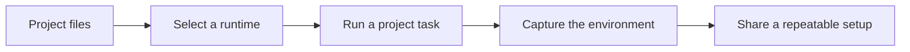

# OMG

<div align="center">

[](https://github.com/omg-cli/omg/actions/workflows/ci.yml)
[](https://github.com/omg-cli/omg/releases/latest)
[](LICENSE)
[](https://getomg.xyz)
[](https://getomg.xyz/docs)
[](rust-toolchain.toml)

**Your development environment, in one command.**

*Packages, runtimes, project tasks, and environment records with one workflow.*

[Try OMG](https://getomg.xyz) · [Read the docs](https://getomg.xyz/docs) · [Start the quickstart](docs/quickstart.md) · [Install](docs/installation.md)

</div>

---

> [!IMPORTANT]
> **Beta preview:** the core workflows are ready to evaluate and the beta release is next. Command surfaces and configuration details may still evolve as we finish the release.

## What OMG does

OMG gives a project one place to answer four everyday questions: which tools should I use, where do I get them, how do I run this project, and what changed between machines?

It brings system packages, language runtimes, developer tools, and project tasks into a single Rust CLI. You keep the native tools underneath, but you get one consistent workflow on every supported machine.

## See it in a minute

From a project you already know:

```bash
# Choose the runtime for this project
omg use node 22
omg which node

# Run the task the project already defines
omg run build

# Record the working environment when you want to share or compare it
omg env capture
omg env check
```

The commands follow the project instead of asking you to learn a different tool for every ecosystem. OMG reads the project metadata that is already there, so a `package.json`, `Cargo.toml`, Makefile, or supported mise configuration can stay the source of truth.



## Why developers use it

| Need | OMG gives you |
| :--- | :--- |
| **Stop switching between tools** | One command shape for packages, runtimes, tools, and tasks. |
| **Keep projects on the right runtime** | Select a version per project and inspect the binary that will run. |
| **Start a new project quickly** | Discover, install, and run the tools the project expects. |
| **Make “works on my machine” easier to debug** | Capture an environment record and check it for drift. |
| **Keep control at install boundaries** | Verification and review steps are built into managed downloads and builds. |

### Packages and developer tools

Use the same vocabulary whether you are looking for a system package or a registry tool:

```bash
omg search ripgrep
omg info ripgrep
omg install ripgrep
omg tool install <tool>
```

`omg install --dry-run` lets you preview a package change before applying it. Backend-specific behavior, AUR review, and managed-tool policies are documented in the [package](docs/packages.md), [AUR](docs/aur.md), and [CLI](docs/cli.md) references.

### Runtime versions that follow the project

Switch Node.js, Python, Rust, Go, Ruby, Java, Bun, Deno, and other supported runtimes without rebuilding your workflow around a different version manager:

```bash
omg use python 3.12
omg which python
```

Shell integration can select supported project versions when you change directories. Existing mise projects can reuse supported runtime pins and task definitions; see the [compatibility guide](docs/mise-compatibility.md) for the supported boundaries.

### Tasks that feel native to the repository

Run the task the project already describes:

```bash
omg run dev
omg run test
omg run build
```

OMG detects the project runner and passes through the task output. See the [task runner guide](docs/task-runner.md) for supported project types and task behavior.

## Built for trust and visibility

OMG verifies managed downloads and applies review and isolation controls at the boundaries where packages and tools are fetched, built, or activated. It also leaves an inspectable record of the environment it manages.

Those controls are deliberately specific: they help you see what OMG verified without pretending that community code is automatically safe or that every backend behaves identically. Read the [security model](docs/security.md), [AUR workflow](docs/aur.md), and [public security updates](https://getomg.xyz/security/) when you need the details.

## Install once, use everywhere

The recommended install path is documented for each platform:

```bash
curl --proto '=https' --tlsv1.2 -fsSL https://getomg.xyz/install.sh | bash
```

Then verify the binary:

```bash
omg --version
omg doctor
```

OMG currently targets Linux x86_64 on Arch, Debian, Ubuntu, and Fedora, plus macOS ARM64. Windows users can run it inside [WSL2](https://learn.microsoft.com/en-us/windows/wsl/install). See the [installation guide](docs/installation.md) for package-managed installs, source builds, verification, and updates.

## Find your next step

- **New to OMG?** Start with the [quickstart](docs/quickstart.md).
- **Moving an existing setup?** Read [runtime detection](docs/runtimes.md) and [mise compatibility](docs/mise-compatibility.md).
- **Building a team workflow?** Use [environment records](docs/team.md) and [workflow patterns](docs/workflows.md).
- **Looking for one command?** Open the [CLI reference](docs/cli.md) or [cheatsheet](docs/cheatsheet.md).
- **Something went wrong?** Check [troubleshooting](docs/troubleshooting.md) or [open an issue](https://github.com/omg-cli/omg/issues).

## Contribute

OMG is open source and built in Rust. Read [CONTRIBUTING.md](CONTRIBUTING.md) to set up a development environment, run checks, and propose a change. The project is released under the [MIT License](LICENSE).
