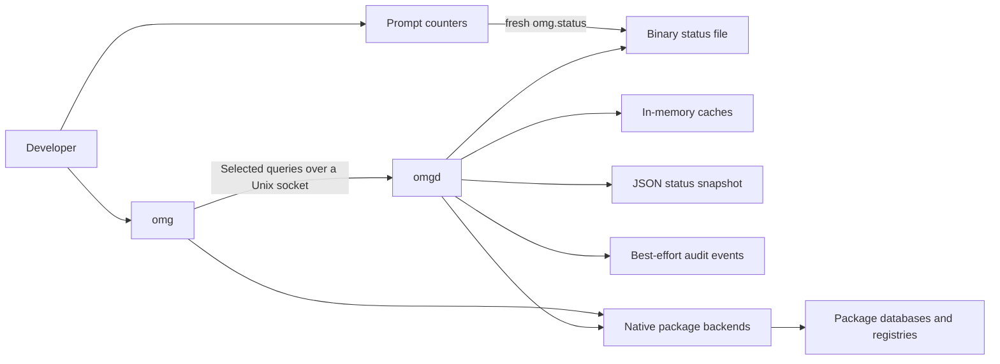
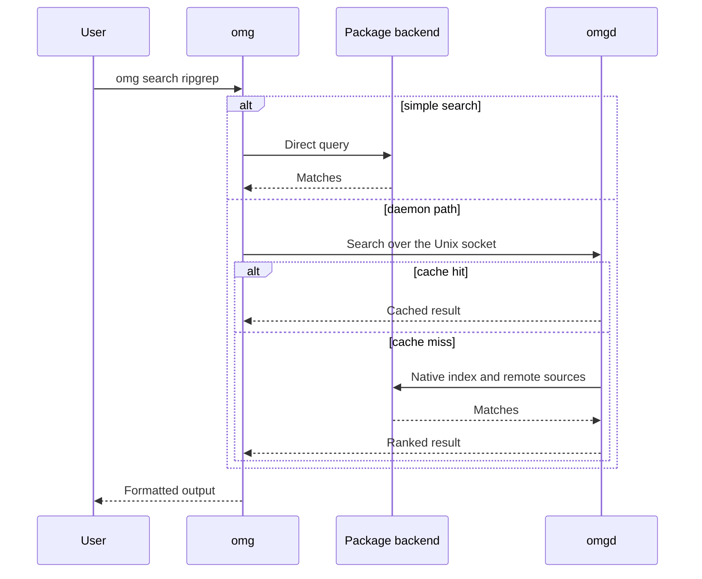
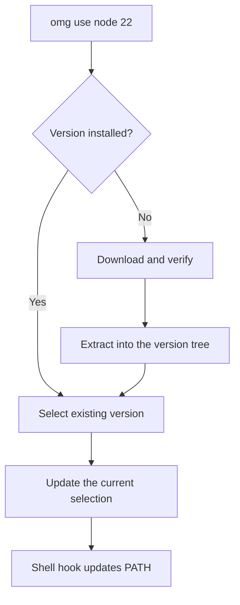

# Architecture

**In plain words:** A map of how OMG is built: the parts, what each part owns, and how they fit together.

> New to the terminal? Read [Getting started](./getting-started.md) and keep
> [the glossary](./glossary.md) open while you work.

OMG ships two binaries, `omg` and `omgd`. Current Linux and macOS release archives include both. Prompt counters are commands on `omg`.

## Request path

Simple `omg search` and `omg info` use a direct backend path. Other queries use `omgd` when it is running and the same direct backends when it is not. Prompt counters (`omg ec`, `omg tc`, `omg oc`, `omg uc`) read the 32-byte `omg.status` file beside the daemon socket when that file is fresh. Otherwise they ask the daemon, then the package backend. Reading the snapshot does not start a daemon.

## Binaries

| Binary | Role |
| --- | --- |
| `omg` | Arguments, package and runtime operations, policy, output, and the terminal dashboard |
| `omgd` | In-memory indexes, background status refresh, and caches for repeated queries |

Native dependencies still vary by backend. Do not assume a static or dependency-free binary. See [installation](./installation.md).

The CLI enforces security policy and formats output. Selected queries talk to `omgd` over a Unix socket when it is running. Hot paths can skip the async runtime and read `omg.status` directly. That read is not a latency guarantee.

The daemon keeps package indexes and status caches warm. It refreshes status every five minutes. Package transactions still run through the CLI and the selected backend.

## Search

On Arch, official and AUR searches run concurrently unless `--no-aur` is set. Debian and Ubuntu use APT. Fedora uses DNF and RPM. macOS uses Homebrew. See [package search](./package-search.md).

## Runtime switch

Versions live under `~/.local/share/omg/versions`. Unknown runtime names fail. OMG does not download another version manager. Pi installs through npm with lifecycle scripts disabled.

## Package backends

| Platform | Integration |
| --- | --- |
| Arch | `libalpm` for local and sync databases, plus an HTTPS AUR client |
| Debian and Ubuntu | Native APT |
| Fedora | DNF and RPM database reads, with subprocess fallbacks |
| macOS | Homebrew |

Library bindings avoid a native CLI subprocess on those paths. Command time still depends on the backend, sources, and cache. See [benchmarks](../benchmarks/README.md).

## Caches

1. **In-memory.** Recent searches, package details, and status, kept in a concurrent cache inside `omgd`.
2. **JSON snapshot.** `status-cache.json`, written with a same-directory temporary file, `fsync`, and atomic rename. Transaction history and the audit log are separate files.
3. **Binary status.** `omg.status` next to the socket. It is 32 bytes: magic, version, four counts, and a timestamp. Prompt counters read it without a daemon request when it is fresh. Readers reject snapshots older than five minutes.

Search indexes are rebuilt from native package databases. They are not durable authority.

## IPC

- Transport is a Unix domain socket.
- Frames are length-delimited.
- Payloads use bitcode, with a version prefix on every frame.

Requests include search, package info, status, security audit, explicit packages, and health checks. See [IPC](./ipc.md).

## Security boundaries

There is no single pipeline that runs PGP, SLSA, vulnerability scanning, and policy checks for every download. Package transactions use backend-specific verification. Runtime downloads use provider-specific integrity checks. Explicit policies are enforceable against ALPM's prepared transaction. Native APT, DNF, and Homebrew install and upgrade paths refuse explicit policy instead of claiming the same enforcement.

`omg audit slsa` checks a supported artifact signature. It does not return a SLSA build level. See [security](./security.md).

The unprivileged audit log defaults to `~/.local/share/omg/audit/audit.jsonl`; root uses a separate data store. `omg audit verify` checks local hash-chain consistency, not authenticity or completeness.

## Background work

Every five minutes the daemon probes installed runtime versions, refreshes vulnerability counts where that scan is supported, updates the in-memory status cache, writes `omg.status`, and atomically replaces the JSON status snapshot. Arch advisory matching applies to Arch packages.

On SIGINT or SIGTERM the daemon finishes active client requests, stops workers, stops accepting connections, removes the socket, and exits. Restart it with `omg daemon`. Derived caches fill again as requests arrive.

## Related pages

- [Daemon](./daemon.md)
- [IPC](./ipc.md)
- [Cache](./cache.md)
- [Package search](./package-search.md)
- [Runtimes](./runtimes.md)
- [CLI reference](./cli.md)
- [Security](./security.md)
