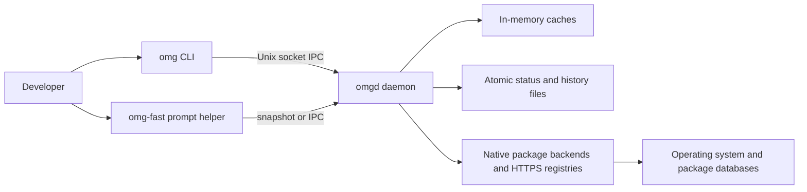
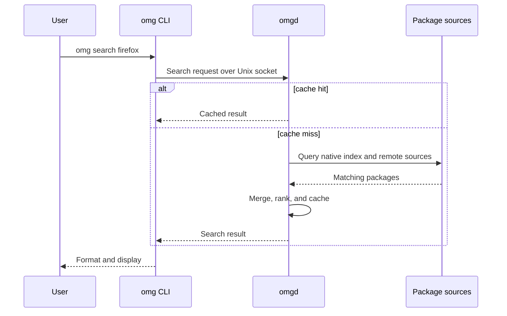
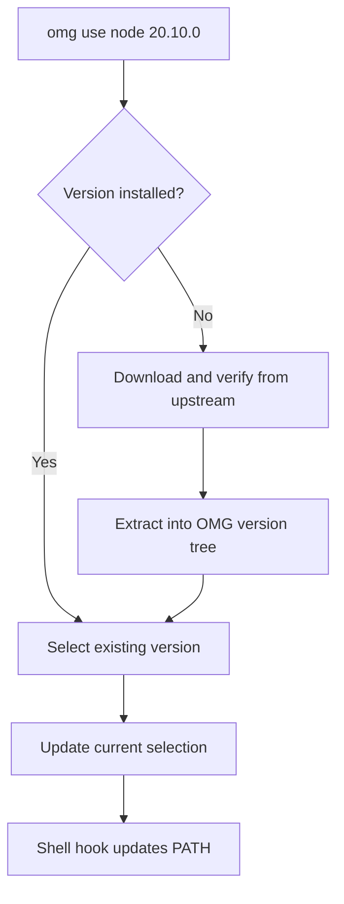
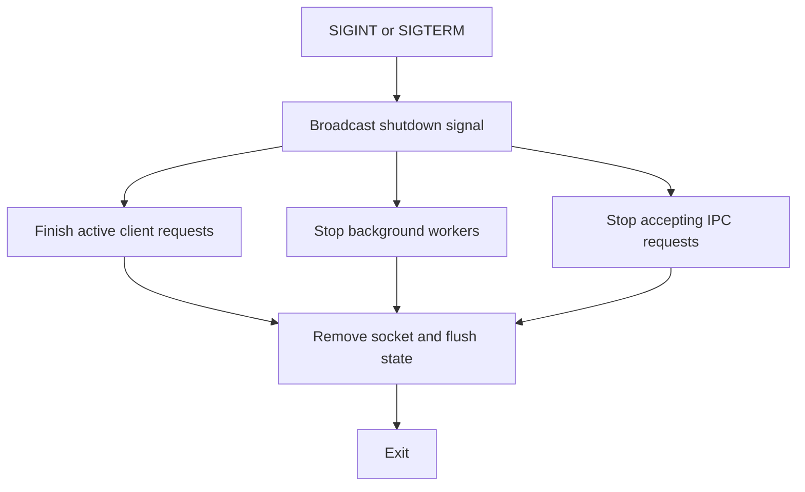

# Architecture Overview

**System Design and Component Architecture**

This document provides a high-level overview of OMG's architecture, component interactions, and design decisions.

---

## 🏗️ System Architecture

The main request path is easier to read as a flow than as a component inventory:



The ASCII schematics below show the storage and backend boundaries in more detail.

```
┌─────────────────────────────────────────────────────────────────────────┐
│                              USER                                        │
│                                │                                         │
│                    ┌───────────┴───────────┐                            │
│                    ▼                       ▼                            │
│              ┌──────────┐           ┌──────────────┐                    │
│              │ Primary  │           │ Speed-Light  │                    │
│              │ CLI      │           │ Optimizer    │                    │
│              └────┬─────┘           └──────┬───────┘                    │
│                   │                        │                            │
│                   │    Private Interface   │ Direct state read          │
│                   ▼                        ▼                            │
│              ┌────────────────────────────────────┐                     │
│              │           System Daemon            │                     │
│              │  ┌──────────────────────────────┐  │                     │
│              │  │      Instant Access Layer    │  │                     │
│              │  │  ┌─────────┐ ┌────────────┐  │  │                     │
│              │  │  │  Active  │ │  Global    │  │  │                     │
│              │  │  │  Cache   │ │  Index     │  │  │                     │
│              │  │  └─────────┘ └────────────┘  │  │                     │
│              │  └──────────────────────────────┘  │                     │
│              │  ┌──────────────────────────────┐  │                     │
│              │  │      Persistence Layer       │  │                     │
│              │  │  ┌─────────┐ ┌────────────┐  │  │                     │
│              │  │  │ Durable │ │ Binary     │  │  │                     │
│              │  │  │ Storage │ │ Status     │  │  │                     │
│              │  │  └─────────┘ └────────────┘  │  │                     │
│              │  └──────────────────────────────┘  │                     │
│              └────────────────┬───────────────────┘                     │
│                               │                                         │
│         ┌─────────────────────┼─────────────────────┐                   │
│         │                     │                     │                   │
│         ▼                     ▼                     ▼                   │
│  ┌─────────────┐      ┌─────────────┐      ┌─────────────┐             │
│  │   Arch      │      │   Debian    │      │   Cloud     │             │
│  │   Handler   │      │   Handler   │      │   Sources   │             │
│  │  (Native)   │      │  (Native)   │      │   (HTTPS)   │             │
│  └─────────────┘      └─────────────┘      └─────────────┘             │
│         │                     │                     │                   │
│         ▼                     ▼                     ▼                   │
│  ┌─────────────────────────────────────────────────────────────────┐   │
│  │                    Operating System                              │   │
│  │    Package DBs        Local Files        Remote Registries       │   │
│  └─────────────────────────────────────────────────────────────────┘   │
└─────────────────────────────────────────────────────────────────────────┘
```

```
┌─────────────────────────────────────────────────────────────────────────┐
│                              USER                                        │
│                                │                                         │
│                                ▼                                         │
│              ┌──────────┐                                                │
│              │ omg CLI  │                                                │
│              └────┬─────┘                                                │
│                   │                                                      │
│                   │    Unix Socket IPC / direct status read              │
│                   ▼                                                      │
│              ┌────────────────────────────────────┐                     │
│              │           omgd (Daemon)            │                     │
│              │  ┌──────────────────────────────┐  │                     │
│              │  │      In-Memory Caches        │  │                     │
│              │  │  ┌─────────┐ ┌────────────┐  │  │                     │
│              │  │  │  moka   │ │  Index     │  │  │                     │
│              │  │  │  LRU    │ │  (Nucleo)  │  │  │                     │
│              │  │  └─────────┘ └────────────┘  │  │                     │
│              │  └──────────────────────────────┘  │                     │
│              │  ┌──────────────────────────────┐  │                     │
│              │  │        Persistence           │  │                     │
│              │  │  ┌─────────┐ ┌────────────┐  │  │                     │
│              │  │  │ Atomic  │ │ Binary     │  │  │                     │
│              │  │  │  JSON   │ │ Status     │  │  │                     │
│              │  │  └─────────┘ └────────────┘  │  │                     │
│              │  └──────────────────────────────┘  │                     │
│              └────────────────┬───────────────────┘                     │
│                               │                                         │
│         ┌─────────────────────┼─────────────────────┐                   │
│         │                     │                     │                   │
│         ▼                     ▼                     ▼                   │
│  ┌─────────────┐      ┌─────────────┐      ┌─────────────┐             │
│  │   libalpm   │      │  rust-apt   │      │  AUR HTTP   │             │
│  │   (Arch)    │      │  (Debian)   │      │   Client    │             │
│  │   Direct    │      │  (Native)   │      │             │             │
│  │   Bindings  │      │             │      │             │             │
│  └─────────────┘      └─────────────┘      └─────────────┘             │
│         │                     │                     │                   │
│         ▼                     ▼                     ▼                   │
│  ┌─────────────────────────────────────────────────────────────────┐   │
│  │                    Operating System                              │   │
│  │    /var/lib/pacman    /var/lib/dpkg    <https://aur.archlinux.org│>   │
│  └─────────────────────────────────────────────────────────────────┘   │
└─────────────────────────────────────────────────────────────────────────┘

```

---

## 📦 Binary Components

Release contents and native dependencies vary by platform and backend. Arch releases include the CLI and daemon; non-Arch release archives omit the daemon. Do not assume static linking or dependency-free portability. See [installation](./installation.md).

### omg (The CLI)
The primary user interface. It is designed for human interaction, providing rich colored output, progress bars, and interactive TUI elements. It handles argument parsing, security policy enforcement, and communicates with the background daemon via a high-performance Unix socket. Prompt counters (`omg ec|tc|oc|uc`) and other hot paths can bypass the async runtime and read the daemon's binary status snapshot. This establishes no universal latency bound.

### omgd (The Daemon)
The "brain" of the system. It runs as a lightweight background service that maintains an in-memory index of all system packages and language runtimes. It handles heavy lifting like background vulnerability scanning, metadata indexing, and complex dependency resolution.


---

## 🔄 Data Flow

### Search Request



```

User: omg search firefox
         │
         ▼
    ┌─────────┐
    │ omg CLI │ Parse args, create Request
    └────┬────┘
         │ Unix Socket
         ▼
    ┌─────────┐
    │  omgd   │ Check moka cache
    └────┬────┘
         │ Cache miss
         ▼
    ┌──────────────────────────────────┐
    │ Parallel Query                    │
    │  ┌─────────┐    ┌─────────────┐  │
    │  │ libalpm │    │ AUR HTTP    │  │
    │  │  query  │    │   query     │  │
    │  └────┬────┘    └──────┬──────┘  │
    │       │                │         │
    │       └───────┬────────┘         │
    │               ▼                  │
    │         Merge & Rank            │
    │           (Nucleo)              │
    └──────────────┬───────────────────┘
                   │
                   ▼
             Update moka cache
                   │
                   ▼
              Serialize Response
                   │
                   ▼
              Return to CLI
                   │
                   ▼
              Format & Display

```

### Runtime Switch



```

User: omg use node 20.10.0
         │
         ▼
    ┌─────────┐
    │ omg CLI │ Detect runtime type
    └────┬────┘
         │
         ▼
    Check if installed
         │
    ┌────┴────┐
    │ Yes     │ No
    │         ▼
    │    Download from
    │    nodejs.org/dist
    │         │
    │    Extract to
    │    versions/node/20.10.0
    │         │
    └────┬────┘
         │
         ▼
    Update symlink
    versions/node/current → 20.10.0
         │
         ▼
    Shell hook updates PATH

```

---

## 🧩 Package Manager Integration

OMG interacts with system package managers using direct library bindings whenever possible to avoid the overhead of spawning subprocesses.

### Arch Linux (libalpm)
The `ArchPackageManager` implementation uses direct FFI bindings to `libalpm` (via the `alpm` crate). This allows OMG to perform package searches, dependency resolution, and transaction management directly within the process memory space, bypassing the `pacman` CLI entirely. This avoids a subprocess on those paths. End-to-end latency still depends on the command, sources, and cache state.

---

## 💾 Caching Strategy

OMG uses a multi-tier caching architecture to eliminate the latency typically associated with package managers.

### 1. In-Memory (moka)
The hottest data (recent searches, package details, system status) is kept in a concurrent, high-performance memory cache. This allows multiple CLI instances to share results instantly without hitting the disk.

### 2. Persistent snapshots
The daemon persists its latest status snapshot as versioned JSON using a same-directory temporary file, `fsync`, and atomic rename. Transaction history and the hash-chained audit log are separate owner-only files; package search indexes are rebuilt from native package-manager databases rather than treated as durable authority.

### 3. Binary Status
A specialized binary status file is maintained by the daemon to store your system's "vital signs" (update counts, error status). Prompt counters (`omg ec|tc|oc|uc`) can read this snapshot without a daemon request; fallback behavior depends on snapshot availability and backend.

---

## 🔌 IPC Protocol

### Transport

- **Socket:** Unix Domain Socket
- **Framing:** Length-Delimited via `LengthDelimitedCodec`
- **Serialization:** `bitcode` (high-performance binary serialization)

### Message Types

The protocol supports a wide range of structured requests and responses:

*   **Search**: Query for packages with optional limits.
*   **Info**: Retrieve detailed metadata for a specific package.
*   **Status**: Get the current system "vital signs" (package counts, updates).
*   **SecurityAudit**: Trigger a vulnerability scan across installed packages.
*   **Explicit**: List packages installed by the user.
*   **System Controls**: Commands for cache management, pings, and health checks.

### Performance

- **Measurements**: See [benchmark methodology and records](../benchmarks/README.md). Serialization microbenchmarks do not establish full command latency.
- **Efficiency**: Persistent connections can issue multiple individually framed requests without a duplicate batch protocol.

---

## 🔧 Runtime Management Architecture

OMG provides a shared runtime-manager interface. Providers differ in installation, version discovery, platform availability, and upstream tooling. Shared command syntax does not make those behaviors identical.

### Version Storage
All runtimes are stored in your home directory (`~/.local/share/omg/versions`), ensuring you never need `sudo` to switch a Node.js version and your system-wide packages remain untouched.

### Resolution Strategy
OMG supports only its native runtime managers. Unknown runtime names fail explicitly rather than downloading or invoking a fallback manager. Pi releases are installed with npm into OMG's version tree using lifecycle scripts disabled, then activated atomically like other runtimes.

---

## 🛡️ Security Architecture

### Verification paths

There is no universal pipeline that runs PGP, SLSA, vulnerability scanning, and policy checks for every download. Package transactions use backend-specific verification. Runtime downloads use provider-specific integrity paths. Explicit policies are enforceable against ALPM's prepared transaction; native APT, DNF, and Homebrew install and upgrade paths refuse explicit policy instead of claiming equivalent enforcement.

`omg audit slsa` is a separate supported-artifact-signature check. `--certificate-identity` optionally binds the Fulcio signer identity; when omitted, a valid signature is reported as unbounded. It returns no SLSA build level and does not verify in-toto provenance. Release archive attestations are verified separately by GitHub CLI. See [security architecture and limits](./security.md).

### Audit Log

Hash-chained, tamper-evident logging:
- Location: `~/.local/share/omg/audit/audit.jsonl`
- Format: JSON Lines
- Each entry contains hash of previous entry
- Integrity verifiable with `omg audit verify`

---

## 📊 Background Workers

### Status Refresh Worker

Runs every 300 seconds:
1. Probe all runtime versions
2. Count vulnerabilities
3. Generate system status
4. Update moka cache
5. Write binary status file
6. Atomically persist the versioned JSON status snapshot

### ALSA Scanner (Optional)

When enabled, periodically:
1. Fetch ALSA issues from security.archlinux.org
2. Match against installed packages
3. Update daemon status with CVE count

---

## 🔄 Graceful Shutdown



```

SIGINT/SIGTERM
      │
      ▼
┌─────────────────┐
│ Broadcast       │ Send shutdown signal
│ Channel         │
└────────┬────────┘
         │
    ┌────┴────┬────────────┐
    ▼         ▼            ▼
Client    Background    IPC
Tasks     Workers       Server
    │         │            │
    │ Finish  │ Stop       │ Stop
    │ request │ loop       │ accept
    │         │            │
    └────┬────┴────────────┘
         │
         ▼
┌─────────────────┐
│ Clean up socket │
└─────────────────┘
         │
         ▼
      Exit

```

---

## 📚 Deep Dives

For detailed documentation on specific subsystems:

- [Daemon Internals](./daemon.md)
- [IPC Protocol](./ipc.md)
- [Caching System](./cache.md)
- [Package Search](./package-search.md)
- [Runtime Management](./runtimes.md)
- [CLI Reference](./cli.md)
- [Security & Audit](./security.md)
