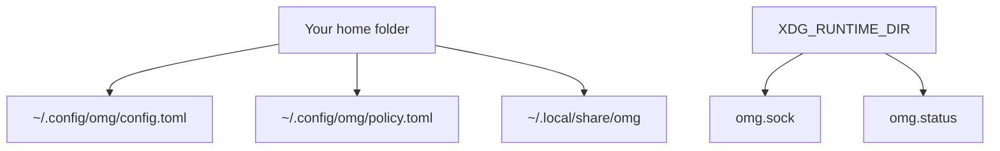

# Configuration

**In plain words:** OMG reads its settings from one small text file, and most people never need to change it. This page shows the file, the settings that really exist, and the ones to leave alone.

> New to the terminal? Read [Getting started](./getting-started.md) and keep
> [the glossary](./glossary.md) open while you work.

## Locate and inspect



```bash
omg config path
omg config list
omg config validate
```

`omg config validate` prints problems it finds, but currently returns success
even when it reports one or more issues. Read its output before using it in a
script or CI job. If no file exists, OMG reports that it is using defaults.

The usual settings path is `~/.config/omg/config.toml`; policy normally lives at `~/.config/omg/policy.toml`. Environment and XDG path resolution can change locations. Use the resolved path, not an assumed home directory. Review output for private paths before sharing it.

General settings are defined by `Settings` and `AurBuildSettings` in `src/config/settings.rs`. Paths for data and sockets are resolved at load time, not deserialized configuration fields. Do not invent `[network]`, daemon, or account-token keys.

Root uses `/var/lib/omg` for data and daemon state and `/var/cache/omg` for caches, ignoring caller home, XDG, and OMG storage overrides. Unprivileged storage overrides remain supported. Existing files are not automatically moved or imported; see [privileged state storage](security.md#privileged-state-storage).

## General and AUR settings

This example shows the current defaults for the boolean and numeric settings:

```toml
telemetry_enabled = false

[aur]
build_method = "bubblewrap"
build_concurrency = 1
review_pkgbuild = true
secure_makepkg = true
allow_unsafe_builds = false
allow_network = false
use_metadata_archive = true
metadata_cache_ttl_secs = 300
cache_builds = true
enable_ccache = false
enable_sccache = false
```

Optional AUR fields are `makeflags`, `pkgdest`, `srcdest`, `ccache_dir`, and `sccache_dir`. They are unset by default. Build methods are `bubblewrap`, `chroot`, and `native`; choosing one does not supply missing host tools. See [AUR support](./aur.md).

Keep recipe review, source verification, and isolation enabled. Allowing unsafe builds or host networking increases what community build code can access. A build-cache hit is not a new security review. Do not weaken these controls as a generic CI recipe.

`build_concurrency` defaults to one, not CPU count. Command-boundary validation rejects invalid values; do not rely on historical load-time clamping as a recommended configuration format. Prefer `omg config validate` and inspect warnings about unsupported keys.

## Get and change a setting

`omg config get` and `omg config set` use CLI key names. Some differ from
the TOML names above. For example:

```bash
omg config get telemetry.enabled
```

```bash
omg config set aur.build_concurrency 2
```

| CLI operation | Accepted keys |
| --- | --- |
| `config get` | `data_dir`, `socket`, `telemetry.enabled`, `aur.build_concurrency`, `aur.enable_ccache`, `aur.enable_sccache`, `aur.secure_makepkg`, `aur.makeflags` |
| `config set` | `telemetry.enabled`, `aur.build_concurrency`, `aur.enable_ccache`, `aur.enable_sccache`, `aur.secure_makepkg`, `aur.makeflags` |

`data_dir` and `socket` are read-only here. To change another accepted TOML
field, edit the file at `omg config path` and validate it. Unknown file keys
fail loading instead of being ignored. `aur.build_concurrency` accepts 1
through 8 at the CLI boundary. A config file larger than 1 MiB is rejected.
Review an existing file before using `omg config reset`; reset writes a
`config.toml.backup` and replaces the file with defaults.

## Security policy

`omg audit policy` displays the applicable policy. Policy grades are source/advisory classifications, not safety certifications or SLSA levels. `Locked` is a reserved grade and is not assigned merely because a package has a familiar name.

ALPM install and upgrade paths check explicit policy against the prepared transaction, including dependencies. Native APT, DNF, and Homebrew paths refuse explicit policies they cannot enforce against the final transaction. There is no automatic organization-wide policy distribution implied by a local file.

See [security policy](./security.md#security-policy) and [enterprise limits](./enterprise.md) before defining requirements. Obtain the policy owner's approval for changes. A missing policy must not be interpreted as a successful compliance check.

## Data and caches

The usual data root is `~/.local/share/omg/`. It includes runtime versions and transaction history, not only caches. The daemon's persistent snapshot is `status-cache.json`; the old `cache.redb` description is obsolete. Consult [cache](./cache.md), [history](./history.md), and [daemon](./daemon.md) for their distinct owners and formats.

Do not delete the data root, rewrite malformed history, or reset audit chains to repair configuration. Preserve original bytes and resolve failures explicitly.

## Telemetry and credentials

Runtime telemetry defaults to off; `OMG_TELEMETRY=0` explicitly disables it. `OMG_NO_TELEMETRY=1` is the installer opt-out. These controls do not disable functional repository, download, or account requests. See [privacy and telemetry](./security.md#privacy-and-telemetry).

Supply optional service credentials through a credential manager or CI secret store. Never add literal tokens to shell startup files or publish configuration dumps containing secrets. Environment sharing requires `GITHUB_TOKEN` and uploads inventory; see [team environments](./team.md).

## Shell and service setup

Follow [shell integration](./shell-integration.md) for hooks and completions. Check for an existing entry before editing a startup file. Only configure a daemon for a release that includes it; follow [daemon](./daemon.md) for service ownership and socket selection. Configuration examples do not authorize package installation, service replacement, or system-level permission changes.

## Where to go next

See [installation](./installation.md) for backend-specific setup and [troubleshooting](./troubleshooting.md) for bounded diagnosis and support.
