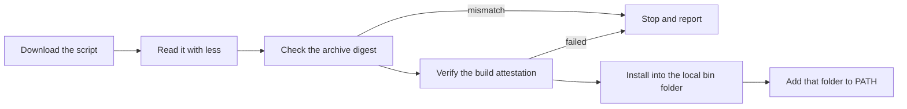

# Install OMG

**In plain words:** This page explains how to put OMG on your computer, which download your machine needs, how to update it, and how to remove it again.

This page shows you how to put OMG on your computer. It starts with a table that tells you which download matches your computer, then walks through the installation one command at a time.

**New to the terminal?** Read [Getting started](./getting-started.md) first. It explains the words on this page and shows you how to open a terminal. [The glossary](./glossary.md) explains any other term you meet.

> **Warning:** OMG is approaching beta, so its makers still change how it behaves. Use a machine you can reinstall (or a virtual machine) when you change system packages, and keep your native package tool (`pacman`, `apt`, `dnf`, or Homebrew) available while you try things.

## Which download do I need?

You usually do not download OMG by hand. The installer script works out which release file your computer needs and fetches it for you. The table shows what it will choose, so you can check that your computer is supported.

| Your computer | What OMG uses there | Release file the installer downloads |
| --- | --- | --- |
| Arch Linux (64-bit Intel or AMD) | Arch packages (ALPM) and the AUR | `omg-v<version>-x86_64-linux-arch.tar.gz` |
| Debian or Ubuntu (64-bit Intel or AMD) | Debian packages (APT) | `omg-v<version>-x86_64-linux-debian.tar.gz` or `omg-v<version>-x86_64-linux-ubuntu.tar.gz` |
| Fedora (64-bit Intel or AMD) | RPM packages (DNF) | `omg-v<version>-x86_64-linux-fedora.tar.gz` |
| Mac with Apple silicon (M1 or newer) | Homebrew packages | `omg-v<version>-aarch64-darwin.tar.gz` |
| Windows | A Linux system inside WSL | The file for the Linux distribution you installed in WSL |
| Mac with an Intel processor | Not supported by current releases | None; Rosetta does not run ARM64 programs on Intel Macs |
| Linux on ARM (for example, a Raspberry Pi) | Not supported by current releases | None |

In those file names, `<version>` is replaced by the release number, so release 0.1.223 is `omg-v0.1.223-x86_64-linux-arch.tar.gz` on Arch.

If your computer is not in the table, OMG cannot run on it yet. Do not install a differently named program that looks similar; it is not the same product.

## What you need first

- A supported computer from the table above.
- An internet connection.
- Permission to install programs into your own home folder. This is the standard way for this installer, and it does not need an administrator account for the install itself.
- Small helper programs that the installer uses to check the download: `curl`, `tar`, `head`, `tr`, and either `sha256sum` or `shasum`.
- The GitHub CLI program, `gh`, for the build-provenance check. Without it, the installer refuses to install a release.
- On macOS, the system file `/usr/bin/perl` must exist; the installer uses it to move the programs into place safely.

## Choose a supported release target

The [release workflow](../.github/workflows/release.yml) builds:

- Linux x86_64 for Arch, Debian, Ubuntu, and Fedora, each with a separate backend archive.
- macOS ARM64 for Apple Silicon, with the Homebrew backend.

There is no current Intel macOS, Linux ARM64, 32-bit x86, or ARMv7 release artifact. Rosetta does not run ARM64 binaries on Intel Macs. Native Windows is unsupported; use a supported Linux distribution inside WSL (Arch, Debian, Ubuntu, or Fedora). Fedora support does not establish RHEL compatibility, although the installer maps RHEL/CentOS-family identification to the Fedora artifact as a best-effort fallback.

Arch uses ALPM and supports AUR builds. Debian and Ubuntu use the native APT backend. Fedora uses DNF, with database reads and subprocess fallbacks. macOS package operations require Homebrew; OMG itself is not packaged as a Homebrew formula here. An unknown Linux distribution is assigned the Fedora artifact by the installer, but that fallback is not a support guarantee.

These backends do not have identical policy, audit, or runtime coverage. Review the [artifact-specific evidence](../benchmarks/README.md) and the release notes before choosing a release; a passing result for one backend does not establish equivalent coverage for another.

### Debian and Ubuntu library compatibility

The installer and self-updater select an archive using the installed system APT library. Match that library when downloading an archive manually:

| System library | Typical distributions | Archive suffix |
| --- | --- | --- |
| `libapt-pkg.so.6.0` | Debian 12, Ubuntu 24.04 | `x86_64-linux-debian.tar.gz` or `x86_64-linux-ubuntu.tar.gz`, respectively |
| `libapt-pkg.so.7.0` | Debian 13, Ubuntu 26.04 | `x86_64-linux-debian-trixie.tar.gz` |

The APT 7 archive must exist in the selected release. Older releases may contain only APT 6 archives; those binaries cannot load against APT 7. Choose a release containing the compatible archive or build from source on the target system. Do not create a library symlink between incompatible major versions.

Before replacing an installed pair, the installer and self-updater verify that both candidate executables (`omg` and `omgd`) start and report the requested version. A failed probe leaves the existing pair in place. These probes establish loader/version compatibility, not full package-manager behavior.

## Step 1: Download the installer and read it

> **Warning:** the installer changes your computer. It copies the OMG programs into your home folder and, unless you set `OMG_SKIP_SHELL=1`, it can also add lines to your shell start-up files. Read it before you run it.

```bash
curl --proto '=https' --tlsv1.2 -fsSL https://getomg.xyz/install.sh -o omg-install.sh
less omg-install.sh
```

**What you should see:** the first command saves a file named `omg-install.sh` in the current folder and prints nothing. The second opens that file so you can scroll through it; press `q` to close it.

## Step 2: Run the installer



The installer downloads the release file for your computer, checks it, and installs it. It may first offer to install a missing helper program with your package manager; read that prompt before you answer. Without `OMG_SKIP_SHELL=1` the installer can modify shell start-up files, so the command below keeps shell edits switched off.

```bash
OMG_NO_TELEMETRY=1 OMG_SKIP_SHELL=1 bash omg-install.sh
```

**What you should see:** progress messages, then `Checksum verified`, then `Build provenance verified`, and finally a line saying the binaries were installed to a folder such as `/home/you/.local/bin`. `OMG_NO_TELEMETRY=1` turns off the installer's optional usage reporting. `OMG_SKIP_SHELL=1` tells it not to touch your shell files.

The installer checks the archive checksum and then verifies the GitHub attestation against the requested release tag and the OMG release workflow. A missing `gh` or a failed check stops the installation. **There is no supported way to use only the checksum and skip the rest in the current script.**

## Step 3: Make the `omg` command findable, then check it

By default, the installer puts the programs in `~/.local/bin`. The `~` sign means your home folder. This command tells the current terminal window to look there (it lasts only for this window):

```bash
export PATH="$HOME/.local/bin:$PATH"
omg --version
omg --help
```

**What you should see:** a version number, then the list of commands. If you see `omg: command not found` instead, repeat the `export` line exactly as written here.

To keep that folder on your `PATH` in every new terminal, add the line to the start-up file of your shell (for example `~/.bashrc` or `~/.zshrc`), or let the installer do it for you by leaving out `OMG_SKIP_SHELL=1`. [Shell integration](./shell-integration.md) explains both options.

## One limit to know about this installer

Checking the archive does not prove that the installer script you downloaded is the original one, because the download address can change over time. If you need a starting point you can check, review a copy of the repository at a commit you trust and run its `install.sh` instead. See [security boundaries](../SECURITY.md#security-boundaries-and-retained-trust).

## Installation options

These settings are read from the shell that runs the script. Set them before the command, on the same line:

| Setting | What it does | Example |
| --- | --- | --- |
| `OMG_NO_TELEMETRY=1` | Turns installer usage reporting off without asking | `OMG_NO_TELEMETRY=1 bash omg-install.sh` |
| `OMG_SKIP_SHELL=1` | Skips shell integration, so your shell start-up files are not changed | `OMG_SKIP_SHELL=1 bash omg-install.sh` |
| `OMG_VERSION=v0.1.223` | Installs one exact release instead of the latest | `OMG_VERSION=v0.1.223 bash omg-install.sh` |
| `INSTALL_DIR="$HOME/.omg/bin"` | Chooses a different folder for the programs | `INSTALL_DIR="$HOME/.omg/bin" bash omg-install.sh` |

```bash
OMG_VERSION=v0.1.223 OMG_NO_TELEMETRY=1 OMG_SKIP_SHELL=1 bash omg-install.sh
INSTALL_DIR="$HOME/.omg/bin" OMG_SKIP_SHELL=1 bash omg-install.sh
```

`v0.1.223` above is only an example of pinning a version. It is not a recommendation that its files pass all tests. Read a release's notes and evidence before you choose it. If you choose a custom folder, you must add it to `PATH` yourself.

## Distribution availability

Install OMG from the verified release installer on this page, or from a source checkout you reviewed yourself. This guide does not promise that `omg` or `omg-bin` is published in the AUR, or that an `omg` crate exists on crates.io. Do not substitute a package with a similar name that you have not checked; it is not the same product. If someone else packages OMG, their package has its own build and trust path and does not have to run the standalone installer's verification steps.

## Build from source

This section is for people who build software from its source code. If you only want to install OMG, use the installer steps above instead.

Use the toolchain pinned in `rust-toolchain.toml`, currently Rust 1.95.0. Build prerequisites depend on the backend. Arch needs libalpm and its development dependencies. Native Debian builds need `libapt-pkg-dev`, `clang`, `cmake`, `pkg-config`, and OpenSSL development headers. macOS needs Xcode Command Line Tools. See [contributing](../CONTRIBUTING.md) for development setup.

The installer's own source-build path (`bash ./install.sh --from-source`) checks for `git`, `cargo`, `pkg-config`, and `gcc`, and additionally requires the `libarchive` and `openssl` development libraries on Arch. Install those through your platform's package tool first.

From a reviewed checkout, select exactly one backend:

```bash
# Arch
cargo build --release --locked --no-default-features --features arch,pgp,license
# Debian or Ubuntu
cargo build --release --locked --no-default-features --features debian,pgp,license
# Fedora
cargo build --release --locked --no-default-features --features fedora,pgp,license
# Apple Silicon macOS
cargo build --release --locked --no-default-features --features macos,pgp,license
# Debian index fixtures only (not a live package mutation backend)
cargo build --release --locked --no-default-features --features debian-pure,pgp,license
```

Choose one release backend, and use `debian-pure` only for indexing and test
fixtures. It deliberately refuses live Debian/Ubuntu mutations because it has
no APT privilege boundary or dpkg conffile semantics. Do not run every release
command above. Cargo features are additive, so `--features debian` alone does
not remove the default Arch backend. The `license` feature compiles
account-linking support; it is not a local CLI paywall.

Inspect `target/release/omg --help` before installing a built binary. An explicit source-install path is `bash ./install.sh --from-source` from a trusted checkout. Source builds are not release-attested binaries.

## Set up your shell (optional)

Next, [the quickstart](./quickstart.md) shows how to use OMG in a project. This part is optional: it makes OMG switch runtime versions automatically when you change folders. A **shell hook** is a few lines that run when your shell starts or changes folders; [the glossary](./glossary.md) explains the word. Add the line for your shell to its configuration file, once.

```bash
# Bash
eval "$(omg hook bash)"
# Zsh
eval "$(omg hook zsh)"
```

For Fish:

```fish
omg hook fish | source
```

Use only the line for your shell. Do not combine hooks from several runtime managers that do the same job. Review [shell integration](./shell-integration.md) before combining OMG with another one.

You can also set up tab-completion. This command installs the completion file for Bash and tells you where it put it; the `--stdout` form prints the script instead:

```bash
omg completions bash
```

**What you should see:** a message with the location of the installed completion file (or, with `--stdout`, the script text itself). Use `--stdout` only when you want the script. Replace `bash` with `zsh` or `fish` for those shells.

## The background helper (daemon)

OMG runs package commands and vulnerability scans without a separate helper. The optional daemon, whose file name is `omgd`, keeps package indexes, vulnerability results, and status snapshots warm; `omg audit scan` uses it when available and starts a direct cold scan otherwise. Unix SOC 2 export and metrics still require the daemon. The current SBOM command needs the Arch package backend and access to an advisory service, whether or not the daemon runs. [The glossary](./glossary.md) explains the word "daemon".

```bash
omg daemon-status
omg daemon
```

`omg daemon` starts `omgd` in the background. Use `omg daemon --foreground` if you want to watch its output, or set up the optional [user service](./configuration.md). Every Linux and macOS release archive contains matching `omg` and `omgd` programs. Older archives for systems other than Arch, including v0.1.222, do not contain `omgd`; use a release that has the matching pair for commands that need the daemon.

## Update or uninstall

To update a standalone release installation:

```bash
omg self-update
```

**What you should see:** messages about downloading and checking the new release, then confirmation that the new files were installed. The updater needs both programs in the same verified archive, and it puts the previous files back if a replacement fails. If the daemon (the background helper) is already running, restart it afterward so it loads the new program: use `systemctl --user restart omgd.service` for the user service. Older installed updaters replace only the main program: after the first upgrade to a release that contains this fix, run `omg self-update --force` once so the daemon is repaired as well.

If you installed OMG with an AUR package manager, update it there instead. Do not mix installation methods without checking which program `command -v omg` finds.

> **Warning:** uninstalling removes programs and can edit your shell start-up files. Run the installer's `--uninstall` mode to remove a script installation. It first makes a backup of each shell file it changes, named `<file>.omg-backup`, and the mode leaves your configuration and caches in place. For an AUR installation, use `yay -R omg-bin` or the package name you installed.

Do not delete `~/.local/share/omg` as a routine step when you remove the program. That folder can contain language runtimes, audit history, and other lasting data. Back it up and remove it separately, only if you intend to.

## CI setup

If you install OMG in a build pipeline, pin both the installer source and the OMG release instead of always taking the latest. Make sure `gh` can perform the attestation verification. Set `OMG_NO_TELEMETRY=1` and `OMG_SKIP_SHELL=1`, and add the chosen program folder to the CI job's `PATH` explicitly. Editing shell start-up files is not a substitute for setting up the job's environment.

Install named system packages or choose the needed runtimes before you run project tasks. Bare `omg install` is an interactive package picker, not a way to install a project's dependencies. `omg env check` reports drift; it does not fix it.

## If something goes wrong

| What you see | What it means | What to do |
| --- | --- | --- |
| `omg: command not found` right after installing | The terminal does not look in the folder where OMG was installed | Run `export PATH="$HOME/.local/bin:$PATH"`, or open a new terminal window, or follow [shell integration](./shell-integration.md) |
| The installer says GitHub CLI is required | `gh` is missing, so the build-provenance check cannot run | Install `gh` with your package tool, then run the installer again |
| `Checksum verification failed` | The downloaded file does not match its published checksum | Stop. Do not try to skip the check. Download again; if it fails again, report it |
| `Build provenance verification failed` | The download did not match the signed record from the release workflow | Stop. Do not turn the check off. Report it privately, as described in [SECURITY.md](../SECURITY.md) |
| `Intel macOS is unsupported` | You are on a Mac with an Intel processor | OMG releases cannot run there. Use a supported computer or a Linux virtual machine |
| `Unknown Linux distro ... using Fedora binary` | The installer does not recognise your Linux distribution | This fallback is not a support guarantee; see [troubleshooting](./troubleshooting.md) if it fails |
| `Permission denied` | The installer cannot write to the chosen folder | Choose a folder inside your home folder with `INSTALL_DIR`, or fix the folder's permissions |
| Download stops partway | The internet connection dropped | Run the installer again; it downloads a fresh copy |

## Next steps

- [Run your first project task](./quickstart.md).
- [Getting started](./getting-started.md) and [the glossary](./glossary.md) for any term you met here.
- [Backend security limits](./security.md).
- [Troubleshoot installation](./troubleshooting.md).
