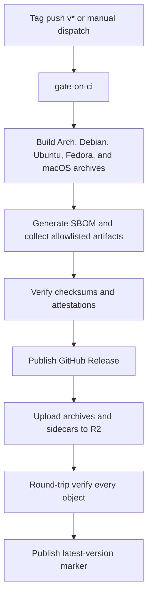

# Release Operations

> **Who this page is for:** OMG maintainers and contributors. It documents publishing a release.
> It is not an everyday user guide. If you are new to OMG, start with
> [Getting started](./getting-started.md).

How releases are built, published, verified, and rolled back.

## Pipeline overview



```
tag push (v*) or manual dispatch
        │
        ▼
gate-on-ci ──▶ build-arch / build-debian / build-ubuntu / build-fedora / build-macos
   (1)                  │  (digest-pinned distro containers, 1.95.0 toolchain)
                        ▼
                   release (SBOM → checksum-verified collection → attest → GitHub Release)
                        │
                        ▼
                   sync-r2  (environment: production)
                         1. upload archives + .sha256 sidecars to R2
                         2. round-trip verify every uploaded object
                         3. publish `latest-version` marker (LAST)
```

Checks configured in `.github/workflows/release.yml`:

- **No publish from a red commit.** `gate-on-ci` requires successful `CI` and
  `Benchmark` runs for the exact release commit; in-progress runs are *watched
  to completion* rather than raced. A nonpublishing dry run skips this gate.
  Existing-tag R2 sync follows a separate published-release verification path.
- **Reproducible dependency set.** Every build uses `--locked` against
  `Cargo.lock`; the SBOM job fails if generation mutates the lockfile.
- **Artifact allowlist.** `scripts/collect-release-artifacts.sh` refuses
  anything that is not exactly the five platform archives, their `.sha256`
  sidecars, and the CycloneDX SBOM.
- **Fail-closed publish.** If any uploaded R2 object cannot be re-downloaded
  byte-identical, the job aborts *before* the `latest-version` marker moves.
- **Cache policy matches mutability.** Version-addressed archives and `.sha256`
  sidecars are uploaded with `Cache-Control: public, max-age=31536000,
  immutable`; the only mutable pointer, the `latest-version` marker, is
  published with `Cache-Control: no-store` by both `release.yml` and
  `scripts/r2-rollback.sh`, so subsequent version checks fetch the current marker.
- **Remote R2 only.** Wrangler 4's `r2 object` commands default to local
  Miniflare storage. `release.yml` and `scripts/r2-rollback.sh` pass `--remote`
  so publishes hit the production `omg-releases` bucket.
- **Pinned release tooling.** All actions are SHA-pinned (Renovate with a
  7-day dwell time), containers are digest-pinned, and `wrangler` is installed
  with `npm ci` from a committed lockfile (`.github/deps/release-tools`), so
  downloaded npm packages are checked against their locked integrity hashes.

The dependency SBOM is real generated output from pinned `cargo-cyclonedx`, using all Cargo features and targets. It is published with the GitHub Release and attested alongside the archives. It is not an installed-system SBOM or an exact per-platform binary dependency subset. The current R2 upload loops publish archives and checksum sidecars, not the SBOM.

GitHub Actions attestations do not by themselves establish SLSA Levels 1–3 or hardened-builder compliance. The separate `omg audit slsa` implementation does not verify these in-toto build attestations. Use the release-specific `gh attestation verify` checks instead.

## Recovering an R2 sync

If GitHub publication succeeds but `sync-r2` does not, dispatch the `Release`
workflow from `main` with `sync_existing_tag` set to the published tag and
`dry_run` set to `false`. The default dry run does not sync or publish. This
path does not rebuild or edit the release. It downloads exactly five archives
and five checksum sidecars, verifies every checksum and GitHub attestation
against the tag's commit, then runs the normal production R2 upload,
round-trip verification, and latest-marker sequence.

## Client-side verification chain

Clients never trust the release bucket alone:

| Layer | Installer (`install.sh`) | `omg self-update` |
|---|---|---|
| TLS | HTTPS-only pinned hosts (`releases.omg.latham.cloud`) | HTTPS + redacted error URLs |
| Latest resolution | R2 `latest-version` marker only: bounded bare-SemVer text, fail-closed; exact `OMG_VERSION` installs use the given tag verbatim | R2 `latest-version` marker only (R2-only, fail-closed) |
| Checksum | mandatory `.sha256` sidecar | pinned digest verified before extraction |
| Downgrade protection | installs only the resolved latest or the exact requested version | refuses older versions without `--force` |
| Build provenance | `gh attestation verify`; missing `gh` causes refusal, with no supported installer opt-out | `gh attestation verify`; missing `gh` causes refusal unless `OMG_SELF_UPDATE_ALLOW_UNVERIFIED_PROVENANCE=1` explicitly opts out |
| Size bounds | curl + disk constraints | 256 MiB streaming cap, 16 MiB prealloc cap |

The provenance layer exists precisely because a compromise of the R2
credentials could rewrite binaries **and** checksum sidecars together;
GitHub attestations are verified outside the bucket against the selected source
and workflow identity. This retains trust in GitHub, the repository, the release
workflow, and its build environment; it does not eliminate supply-chain risk.

Both clients download archives and sidecars from the R2 release domain
(`https://releases.omg.latham.cloud`). GitHub Releases remains the documented
mirror of the same immutable objects, and the installer pins each archive to
the version it already resolved. The installer resolves "latest" from the R2
marker only. Repointing the marker changes version selection, not the client's
downgrade policy.

## Rollback

`latest-version` is the only intentionally mutable pointer; release operations
must treat version-addressed archives as immutable. To select a previously
published version for new downloads:

```bash
export CLOUDFLARE_API_TOKEN=... CLOUDFLARE_ACCOUNT_ID=...
./scripts/r2-rollback.sh 0.1.214           # verify + re-point marker
./scripts/r2-rollback.sh 0.1.214 --dry-run # preview only
```

The script refuses to move the marker to a version whose archives are not
fully present in R2 (all five platforms). Fresh installations use the selected
version. Installed clients resolve the same marker, but a normal `omg self-update`
refuses a version older than the installed binary. Users must run
`omg self-update --force` to accept that downgrade. Checksum and provenance
verification still apply. The script does not modify installed binaries.

**To withdraw (rather than roll back) a version with a bad or malicious
binary:** delete its objects from the R2 `omg-releases/` prefix and from
GitHub Releases, rotate credentials if compromise is suspected, then publish
a fixed version and cut a security advisory (see SECURITY.md).

## Credential rotation

Rotate **immediately and unconditionally** if any of the following trigger:

- `CLOUDFLARE_API_TOKEN` appears in a log, PR, or a gitleaks/trufflehog alert
- A release job fails round-trip verification without an obvious cause
- Any unexpected commit to `.github/workflows/` on `main`
- A maintainer account shows unrecognized sessions

Rotation procedure:

1. Create a fresh token scoped to **only** the `omg-releases` R2 bucket (object read/write, no account-level roles).
2. Update the `CLOUDFLARE_API_TOKEN` secret in the `production` environment (release.yml).
3. Delete the old token in the Cloudflare dashboard; verify the new token fails with the old value.
4. Review the Cloudflare audit log for the window since the last known-good release.

## Known platform gaps (documented, not hidden)

- **Windows native:** there is no `windows` cargo feature or backend. Windows
  users are supported through WSL only. A native
  port requires a new package-manager feature and should add a
  `build-windows` CI leg at the same time the feature lands.
- **Linux aarch64:** no release artifact exists; `self_update` fails with an
  explicit error directing users to the manual path rather than
  installing a wrong-arch binary.

**Last Updated:** 2026-09-04
