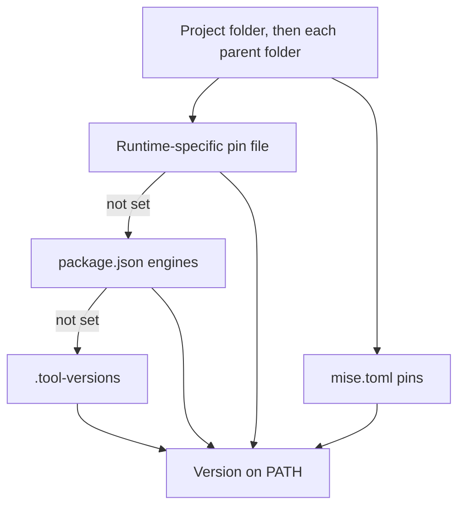

# Runtime Management

**In plain words:** A runtime is the program that runs code written in a language such as Node.js, Python, or Rust. This page shows how to install and switch versions inside your own home folder, without an administrator password.

> New to the terminal? Read [Getting started](./getting-started.md) and keep
> [the glossary](./glossary.md) open while you work.

OMG provides one interface for selecting supported language runtimes. Setup requirements and switching costs depend on the provider, installed versions, shell, and filesystem; no universal latency or reliability comparison is established.

## Supported Runtimes

### Native Runtimes

OMG implements provider-specific native runtime managers directly in Rust without external shell shims. Runtime installation, archive extraction, and project builds have platform-specific prerequisites; do not assume every workflow is dependency-free. Consult each provider's documented requirements. All runtimes also detect version pins from `mise.toml` and `.mise.toml`.

| Runtime | Auto-detect File | Install Command | Switch Command | Binaries |
| --------- | ------------------ | ----------------- | ---------------- | ---------- |
| **Node.js** | `.node-version`, `.nvmrc`, `package.json`, `.tool-versions` | `omg use node 20` | `omg use node 18` | `node`, `npm`, `npx` |
| **Python** | `.python-version`, `pyproject.toml`, `.tool-versions` | `omg use python 3.12` | `omg use python 3.11` | `python3`, `pip` |
| **Go** | `.go-version`, `go.mod`, `.tool-versions` | `omg use go 1.21` | `omg use go 1.20` | `go`, `gofmt` |
| **Rust** | `rust-toolchain`, `rust-toolchain.toml`, `.tool-versions` | `omg use rust stable` | `omg use rust nightly` | `rustc`, `cargo` |
| **Ruby** | `.ruby-version`, `.tool-versions` | `omg use ruby 3.2` | `omg use ruby 3.1` | `ruby`, `gem` |
| **Java** | `.java-version`, `.tool-versions` | `omg use java 21` | `omg use java 17` | `java`, `javac` |
| **Bun** | `.bun-version`, `package.json`, `.tool-versions` | `omg use bun latest` | `omg use bun 1.0` | `bun` |
| **Deno** | `.deno-version`, `.dvmrc`, `.tool-versions` | `omg use deno latest` | `omg use deno 2.9` | `deno` |
| **Pi** | `.tool-versions` | `omg use pi 0.83.0` | `omg use pi 0.84.3` | `pi` |
| **Zig** | `.zig-version`, `.tool-versions` | `omg use zig 0.13.0` | `omg use zig 0.12.0` | `zig` |
| **.NET** | `global.json`, `.tool-versions` | `omg use dotnet 8.0` | `omg use dotnet 9.0` | `dotnet` |
| **Erlang** | `.tool-versions` | `omg use erlang 26.2` | `omg use erlang 27.0` | `erl`, `erlc` |
| **PHP** | `.php-version`, `.tool-versions` | `omg use php 8.3` | `omg use php 8.2` | `php` |
| **Swift** | `.swift-version`, `.tool-versions` | `omg use swift 5.10` | `omg use swift 6.0` | `swift`, `swiftc` |

Unknown runtime names fail explicitly. OMG does not download or invoke a fallback runtime manager.

OMG exposes each selected runtime's vendor directory on `PATH`. It does not reimplement package managers or proxy their commands. Tools shipped with a runtime, such as `npm`, `npx`, `pip`, `cargo`, `gofmt`, and `javac`, run directly from that selected installation.

---

## Quick Examples

### Node.js

```bash
# Install Node.js 20
omg use node 20

# Auto-detect from .nvmrc
echo "20.10.0" > .nvmrc
cd .  # Shell hook auto-switches

# List installed versions
omg list node

# Show current version
omg which node

# Install specific version
omg use node 20.10.0

# Use LTS version
omg use node lts
```

### Python

```bash
# Install Python 3.12
omg use python 3.12

# Auto-detect from .python-version
echo "3.12.1" > .python-version
cd .  # Auto-switch

# Use in virtual environment
omg use python 3.12
python -m venv .venv
source .venv/bin/activate

# Install specific patch version
omg use python 3.12.1
```

### Go

```bash
# Install Go 1.21
omg use go 1.21

# Auto-detect from go.mod
echo "module myapp" > go.mod
echo "go 1.21" >> go.mod
cd .  # Auto-switch

# List available versions
omg list go --available
```

### Rust

```bash
# Install Rust stable
omg use rust stable

# Use nightly for a project
echo "nightly" > rust-toolchain
cd .  # Auto-switch to nightly

# Use specific version
omg use rust 1.75.0
```

Only one Rust toolchain mutation can run at a time within an OMG data directory. If another operation is running, wait for it to finish and retry. The lock covers updates, removal, and activation. It is released when the operation or process ends. Do not delete `versions/rust/.mutation.lock`; its presence alone does not mean an operation is running.

Incremental component and target additions must match the installed toolchain's recorded compiler release, including its nightly commit. If the upstream release changes, OMG rejects that incremental addition before copying or replacing files. Retry setup to refresh the toolchain first. This does not undo a preceding channel refresh. Legacy metadata remains readable, but a missing or empty release identity requires a complete reinstall before incremental additions. Matching compiler identity does not verify an identical whole manifest.

### Deno

```bash
# Install the newest stable Deno release
omg use deno latest

# Select the newest installed 2.9 patch for this project
echo "2.9" > .deno-version
cd .

# List available releases
omg list deno --available
```

### Ruby

```bash
# Install Ruby 3.3
omg use ruby 3.3

# Auto-detect from .ruby-version
echo "3.3.0" > .ruby-version
cd .
```

### Java

```bash
# Install Java 21
omg use java 21

# Auto-detect from .java-version
echo "21" > .java-version
cd .
```

### Bun

```bash
# Install Bun 1.0
omg use bun 1.0

# Auto-detect from .bun-version
echo "1.0.25" > .bun-version
cd .
```

### Pi

```bash
# Install Pi agent
omg use pi latest
```

### Multiple Runtimes (Typical Project)

```bash
# Install all runtimes for a full-stack project
omg use node 20
omg use python 3.12
omg use rust stable

# Captured in omg.lock for team sync
omg env capture

# Team member verifies against the lock
omg env check
# (restore from a shared Gist with: omg env sync <gist-url>)
```

---

## How Runtime Switching Works

### 1. Shell Hook Detects Directory Change

```bash
cd /my/project  # Shell hook runs on directory change
```

### 2. OMG Reads Version Files

OMG scans for version files in priority order:

**Node.js Priority:**

1. `.node-version`
2. `.nvmrc`
3. `package.json#engines.node` or `package.json#volta.node`
4. `.tool-versions`

**Python Priority:**

1. `.python-version`
2. `pyproject.toml#project.requires-python`
3. `.tool-versions`

**Rust Priority:**

1. `rust-toolchain`
2. `rust-toolchain.toml`
3. `.tool-versions`

### 3. Updates PATH Instantly

```bash
# Before: /usr/bin/node → 16.0.0
# After:  ~/.local/share/omg/versions/node/20.10.0/bin/node
```

**No subprocess overhead** - Direct PATH manipulation in your shell.

### 4. Works in Subshells

```bash
# Version persists in subshells
(node --version)  # Uses correct version

# Tmux/screen sessions inherit version
tmux new-session "node server.js"
```

---

## Auto-Detection Priority



When multiple version files exist in the same directory:

### Node.js

1. `.node-version` (highest priority)
2. `.nvmrc`
3. `package.json#engines.node` or `package.json#volta.node`
4. `.tool-versions`

### Python

1. `.python-version` (highest priority)
2. `pyproject.toml#project.requires-python`
3. `.tool-versions`

### Override Auto-Detection

```bash
# Switch to a specific version
omg use node 18

# Show which version file is active
omg which node
```

---

## Migration from Other Tools

> **Note:** There are no automatic migration subcommands (`omg migrate from-nvm`
> and similar do not exist — `omg migrate` only supports `export`/`import` of a
> portable manifest). Migration is manual: note your versions with the old tool,
> then install them with OMG as shown below.

### From nvm (Node Version Manager)

```bash
# Manual migration
nvm list  # Note your versions
omg use node 20
omg use node 18
npm install -g $(npm list -g --depth=0 --json | jq -r '.dependencies | keys[]')
```

### From pyenv (Python Version Manager)

```bash
# Manual migration
pyenv versions  # Note your versions
omg use python 3.12
omg use python 3.11
```

### From rustup (Rust Toolchain Manager)

```bash
# Manual migration
rustup show  # Note your toolchains
omg use rust stable
omg use rust nightly
```

**Migration is non-destructive** - Your existing tools remain installed until you remove them.

---

## Performance Comparison

Compare installed-version activation separately from downloads, builds, and shell startup. Record the exact runtime, artifact, shell, filesystem, and warm/cold conditions. [Package-query benchmarks](../benchmarks/README.md) do not establish runtime-manager speedups.

---

## Security and Integrity

Safety is a first-class citizen in OMG's runtime management:

### Cryptographic Verification

OMG verifies downloaded runtime archives against published checksums or release digests:

- **Node.js**: SHA256 checksums from `SHASUMS256.txt`
- **Python**: SHA256 digests from python-build-standalone release metadata
- **Rust**: SHA256 from rust-lang.org manifests
- **Go**: Official binary checksums
- **Java**: Adoptium checksums
- **Ruby**: SHA256 digests from GitHub release metadata
- **Bun**: SHA256 digests from GitHub release metadata
- **Deno**: SHA256 digests or official checksum sidecars from Deno releases

Pi installation is delegated to npm with `--global --ignore-scripts`, followed by an installed-version check. It does not use OMG's archive-digest verification path; registry and integrity handling follow npm's configuration.

### Secure Transport

Official runtime endpoints use HTTPS with certificate validation. The shared HTTP client rejects HTTPS-to-HTTP redirects. npm-managed installation follows npm's transport configuration.

### Sandboxed Installations

All runtimes installed in user-local directory:

```
~/.local/share/omg/versions/
├── node/
│   ├── 20.10.0/
│   └── 18.19.0/
├── python/
│   ├── 3.12.1/
│   └── 3.11.7/
└── rust/
    ├── stable/
    └── nightly/
```

**Benefits:**

- **No Sudo Required** - Never need administrative privileges
- **Isolation** - Versions cannot interfere with each other
- **Version removal** uses `omg use node 20.10.0 --uninstall`. Switch away from an active version first.

### Staged installations

OMG extracts each runtime into a temporary directory on the same filesystem. It publishes the version directory only after extraction and validation succeed.

---

## Troubleshooting

### Version Not Switching

**Symptom:** Running `omg use node 20` but `node --version` shows old version.

**Check shell hook:**

```bash
type _omg_hook  # Should show it's a shell function
```

**Fix: Re-source shell config:**

```bash
exec $SHELL  # Restart shell
# OR
source ~/.zshrc  # For zsh
source ~/.bashrc  # For bash
```

---

### Auto-Detect Not Working

**Symptom:** `.nvmrc` exists but version doesn't auto-switch.

**Check version file:**

```bash
cat .nvmrc  # Should contain version like "20.10.0" or "20"
```

**Switch to a specific version:**

```bash
omg use node 20
```

**Verify shell hook is installed:**

```bash
grep "omg hook" ~/.zshrc  # Should exist
```

---

### Installation Failed

**Symptom:** `omg use node 20` fails with network error.

**Check network connectivity:**

```bash
curl -I https://nodejs.org/dist/
```

`node.mirror` is not a supported config key. Inspect the provider error and network access. Do not bypass download integrity checks or substitute an untrusted mirror.

**Check disk space:**

```bash
df -h ~/.local/share/omg
```

---

### Binary Not Found After Install

**Symptom:** `node: command not found` after `omg use node 20`.

**Check PATH:**

```bash
echo $PATH | grep omg  # Should contain active omg runtime bin path
```

**Verify installation:**

```bash
omg which node
ls -la ~/.local/share/omg/versions/node/20.*/bin/node
```

**Fix: Restart shell or re-source config:**

```bash
exec $SHELL
```

---

### Conflicting Global Packages

**Symptom:** Global packages installed with `npm install -g` disappear after version switch.

**Explanation:** Global packages are version-specific in OMG (by design for isolation).

**Solution 1: Install per version:**

```bash
omg use node 20
npm install -g typescript

omg use node 18
npm install -g typescript  # Separate install for Node 18
```

**Solution 2: Use project-local packages:**

```bash
npm install --save-dev typescript  # Better practice
npx tsc  # Run without global install
```

---

## See Also

- [Shell Integration](shell-integration.md) - Shell hook setup and configuration
- [Configuration](configuration.md) - Runtime-specific settings
- [Team Sync](team.md) - Lock files and environment sharing
- [Security](security.md) - Verification and integrity checks
- [Troubleshooting](troubleshooting.md) - Common issues and solutions
