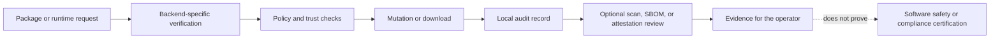

# Security model

**In plain words:** This page describes the checks OMG performs, which of them depend on your operating system, and what its reports do not prove.

> New to the terminal? Read [Getting started](./getting-started.md) and keep
> [the glossary](./glossary.md) open while you work.

OMG provides package verification, vulnerability reports, secret scanning, and local audit records. These controls do not prove that software is safe or that an organization meets a compliance framework. Capabilities depend on the compiled backend and the command path.

The evidence path has explicit boundaries at each step:



## Privileged state storage

Processes running as root use `/var/lib/omg` for data and daemon state, and `/var/cache/omg` for caches. Caller-supplied `OMG_DATA_DIR`, `OMG_DAEMON_DATA_DIR`, `OMG_CACHE_DIR`, home variables, and XDG variables do not select these privileged storage locations. Unprivileged paths and overrides are unchanged. These system directories must remain administrator-controlled; do not redirect them to user-writable storage.

History, usage files, locks, and AUR metadata stay owned by the process that writes them. OMG no longer transfers ownership through a pathname after publication.

Existing user files are neither moved nor rewritten. Read existing user history without sudo; `sudo omg history` reads entries in the separate root store. There is no automatic import of user-editable history into privileged storage. Operations recorded by an unprivileged parent can still appear in that parent's history, so the root store is not a complete machine audit trail. Root and user caches may need separate refreshes.

Licenses, clock high-water marks, snapshots, and audit files also use the effective-user data store. A user activation does not activate the root profile. Use `omg snapshot restore <id> --yes` without sudo for a user snapshot; package backends request elevation when needed. Explicit sudo selects the root snapshot store. Legacy root-profile files are also left untouched and require administrator review before migration.

Arch update parents retain official and AUR changes in the user's history even when an elevated child records official work separately. This keeps those changes available to unprivileged history and rollback.

This boundary does not authenticate all package metadata or replace the separate configuration and policy checks.

Report vulnerabilities privately using [SECURITY.md](../SECURITY.md).

## Vulnerability scanning

```bash
omg audit scan
omg audit scan --fail-on-findings # CI gate: nonzero when findings exist
```

Published v0.1.223 requires a running `omgd` for `omg audit scan`. The newer main checkout
prefers the daemon so repeated scans can reuse its warm cache, but creates the selected
backend and scanner itself when the daemon is unavailable. In that newer checkout, Arch uses
Arch Linux Security Advisory data. Fedora uses native DNF advisories. Debian and Ubuntu
query OSV using their distribution release as the ecosystem. Missing findings are not
proof that a package is free of vulnerabilities. Do not treat one distribution's
advisories as coverage for another.

The default scan reports findings without failing solely because it found them. Use `--fail-on-findings` when a CI job must fail on any finding. This does not make its human-readable output a documented JSON alert interface. `omg audit fix --dry-run` previews available package updates on the Arch backend; an available update is not proof that every advisory is fixed.

## Security grades

Policy grades are ordered `Risk`, `Community`, `Verified`, and `Locked`. Source classification treats official repository metadata as `Verified` and AUR or local packages as `Community`. A package name such as `glibc` does not confer a `Locked` grade.

`Locked` remains a policy enum value. The current source classifier does not establish SLSA Level 3 or assign that grade to core packages. A displayed grade is not an independent cryptographic receipt or a certification. Requiring `Locked` can reject ordinary official packages.

## Security policy

The local policy is `~/.config/omg/policy.toml`. Inspect it with:

```bash
omg audit policy
```

The policy supports minimum grades, AUR restrictions, package bans, PGP requirements, and license allowlists. See [configuration](./configuration.md).

`omg audit licenses --check-policy` is available with the Arch backend. It evaluates the full installed-package license inventory against a configured allowlist and exits nonzero on violations, even when `--filter` limits displayed rows. Native Debian, Ubuntu, and Fedora inventories do not yet provide reliable license metadata for this command.

Explicit package policies are checked against ALPM's prepared transaction, including dependencies. Native APT, DNF, and Homebrew install and upgrade paths refuse explicit policies because a separate precheck cannot guarantee the final native transaction. Do not assume that a policy enforced on Arch is enforced identically elsewhere. A build with only the `debian-pure` indexing feature refuses live Debian package mutations; use an APT-backed build for those operations.

## Package and runtime verification

Official package verification follows the selected backend and its repository trust configuration. Native PGP verification is available in builds with the `pgp` feature. Signatures authenticate signed bytes under the selected trust policy; they do not inspect package behavior. Expired and future-dated signatures are rejected.

Runtime downloads trust their upstream publishers. Publisher-provided checksums detect corruption, but do not protect against compromise of both an archive and its checksum source. Not every provider follows the same verification path. See [runtime integrity](./runtimes.md).

AUR builds execute community-maintained code. Review PKGBUILDs, sources, and install hooks. Bubblewrap builds are offline by default. Enabling `[aur] allow_network = true` exposes reachable services to build code. Native builds are an explicit unsafe choice. See the [retained trust boundaries](../SECURITY.md#security-boundaries-and-retained-trust).

## Artifact signature verification

Despite its command name, `omg audit slsa` verifies a Sigstore artifact signature against a trusted identity. It does not verify SLSA build provenance or assign a SLSA level.

```bash
omg audit slsa ./package.pkg.tar.zst \
  --certificate-identity "$EXPECTED_SIGNER_IDENTITY"
```

Set `EXPECTED_SIGNER_IDENTITY` to the exact trusted publisher email or OIDC URI obtained independently. The CLI requires this option and rejects an empty identity. Use an existing artifact path without parent-directory traversal.

The verifier hashes the artifact, queries Rekor, checks the entry's signed entry timestamp (SET) against a pinned log key, and handles supported `hashedrekord` signatures. A successful result requires a supported artifact signature and a Fulcio certificate chain. The required identity must match exactly. It does not independently verify a Merkle inclusion proof or a log checkpoint.

Current limits:

- A verified `hashedrekord` result still has SLSA level `None`. It contains no build provenance.
- In-toto attestations are not verified by this engine.
- A Rekor index hit, unsigned local provenance JSON, or a bare public-key self-attestation is not accepted as trusted provenance.
- Pinned trust roots and log keys require deliberate updates. Entries signed under other keys can fail.
- The command does not establish SLSA Levels 1, 2, or 3 for any package category.

### Release attestations

The [release workflow](../.github/workflows/release.yml) separately uses GitHub Actions build-provenance attestations for OMG release archives and the generated dependency SBOM. The installer uses `gh attestation verify`, bound to the selected release tag and workflow. This is distinct from `omg audit slsa` and does not certify a SLSA build level.

## SBOM generation

Two different SBOMs are available.

The release workflow runs pinned `cargo-cyclonedx` against Cargo metadata with all features and targets, checks that `Cargo.lock` is unchanged, and publishes a CycloneDX JSON file on GitHub Releases. This is a dependency inventory for OMG's source configuration, not an inventory of packages installed on your machine or an exact per-binary dependency subset.

The local command emits an installed-package CycloneDX 1.5 JSON inventory:

```bash
omg audit sbom --output ./sbom.json
omg audit sbom --inventory-only --output ./offline-inventory.json
```

By default, the CLI includes vulnerability matching. In published v0.1.223, the command succeeds on Arch when inventory and advisory data are available. Debian and Ubuntu have inventory code but fail at the required vulnerability scan; Fedora has no system SBOM backend. The newer CLI supports Arch, Debian, Ubuntu, and Fedora when their inventory and advisory sources are available. It uses Arch advisories, DNF advisories on Fedora, and OSV on Debian and Ubuntu. macOS has no system SBOM backend. An inventory or advisory failure stops the default command instead of producing a partial success. `--inventory-only` skips advisory matching for an offline package inventory and marks that omission in the SBOM; an empty vulnerability list in that mode is not a clean scan.

The inventory contains package names, versions, descriptions when available, PURLs, available license metadata, and matched vulnerability findings. Fedora's native inventory does not currently supply descriptions or licenses. The generator compares installed identities before and after the scan and refuses a changed inventory. It does not resolve dependency edges or populate component file hashes. It is not an application dependency inventory, a complete supply-chain graph, or proof of regulatory compliance. An advisory fetch failure must not be read as a clean report.

The default location is `~/.local/share/omg/sbom/`. SBOM files are plaintext. The newer exporter writes owner-only files on Unix, including when replacing an existing permissive file. Restrict destination directories and inspect permissions before sharing reports.

## Secret scanning

```bash
omg audit secrets
omg audit secrets --path ./project
```

The scanner reports pattern matches, including supported credential formats and private-key markers. It can miss secrets and can report false positives. Critical findings cause a nonzero exit status. A clean scan does not establish that a repository contains no credentials. Revoke exposed credentials rather than only deleting their text.

## Audit logging

```bash
omg audit log
omg audit log --limit 50 --severity error
omg audit log --export ./audit.json
omg audit log --export ./audit.csv
omg audit verify
```

Screen output defaults to 20 entries. Export defaults to all entries unless `--limit` is supplied. Redirecting the screen display does not produce JSON. A `.csv` extension selects CSV; other extensions select JSON.

`omg audit verify` checks internal hash-chain consistency and refuses a collection marked incomplete. A log owner can rewrite entries and recompute hashes, truncate history, or remove an incompleteness marker. Successful verification proves neither authenticity nor completeness. Retain independent logs if you need evidence against the machine's administrator.

Unprivileged storage defaults to `~/.local/share/omg/audit/audit.jsonl`. Privileged Linux storage is `/var/lib/omg/audit/audit.jsonl`. A trusted legacy `/var/log/omg` collection is migrated atomically on first use. Migration refuses conflicting locations, untrusted permissions, or a cross-filesystem move. Preserve the old data and reconcile it while OMG is stopped; do not delete audit history to clear an error.

Privileged backend operations record attempts and outcomes synchronously. An interrupted operation may have no outcome. The daemon's separate best-effort queue can lose events and records an incompleteness marker when it detects that condition.

## Compliance exports

```bash
omg audit export --framework soc2 --output ./audit-evidence
```

Only `soc2` generates files on this command path. It exports up to 1,000 recent audit entries, a vulnerability scan, a system SBOM, and a policy snapshot. In published v0.1.223, the scan requires `omgd`, and Debian/Ubuntu export fails at the required SBOM scan. The newer main checkout can scan directly when the daemon is unavailable and supports more system SBOM backends. Every backend still needs available inventory and advisory data. `iso27001`, `fedramp`, `hipaa`, and `pci-dss` are accepted names but return an unimplemented error. A failed export may leave partial files.

`--period` is metadata, not a time-range filter. The separate `omg enterprise audit-export` command produces a generic inventory bundle, not framework-specific controls. See [enterprise limits](./enterprise.md).

Audit and enterprise evidence files are plaintext JSON or CSV. Private writers protect audit exports and the newer SBOM exporter with owner-only file permissions on Unix; permissions are not encryption, and a caller-selected directory may still be accessible to others. Restrict the destination directory, inspect every file, and encrypt externally before transport when required. Reports can disclose package inventory, paths, and activity.

OMG does not implement HIPAA controls or certify SOC 2, ISO 27001, FedRAMP, PCI DSS, or HIPAA compliance.

## Privacy and telemetry

Installer telemetry requires consent and defaults to no. Pass `OMG_NO_TELEMETRY=1` to the shell executing the installer to disable it. Runtime telemetry is opt-in and can be disabled with:

```bash
omg config set telemetry.enabled false
omg config get telemetry.enabled
```

`OMG_TELEMETRY=0` and `OMG_DISABLE_TELEMETRY=1` also disable runtime collection. When enabled, runtime telemetry includes canonical command names, timing, success status, backend, session data, and a hashed machine identifier. It does not send positional arguments or raw command output through the documented telemetry path. This does not prevent package, advisory, dashboard, or download services from receiving requests needed by their features.

Queued events are stored in the user's data directory. The final best-effort network flush can add up to its five-second request timeout. Review [telemetry implementation](../src/core/telemetry.rs) and [client](../src/core/telemetry_client.rs) for the exact collection path.

## See also

- [Enterprise reports](./enterprise.md).
- [CLI reference](./cli.md).
- [Configuration](./configuration.md).
- [Security reporting and trust boundaries](../SECURITY.md).
