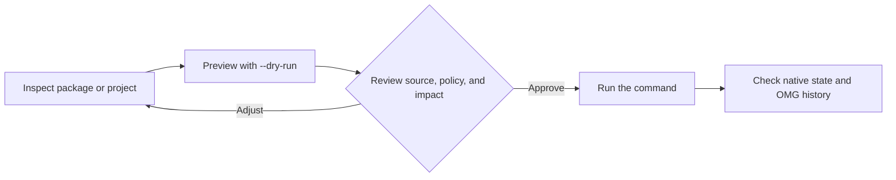

# Workflows

**In plain words:** Complete walkthroughs of common setups, from a first project to a shared team environment.

> New to the terminal? Read [Getting started](./getting-started.md) and keep
> [the glossary](./glossary.md) open while you work.

Examples assume a backend-compatible installation completed using the [verified installation procedure](./installation.md). They are not scripts to execute unattended on an existing machine. OMG is in beta; keep native recovery tools and backups while validating package changes.

The common path is deliberately staged: inspect first, preview changes, then approve the mutation.



## Find and install a package

```bash
omg search ripgrep
omg info ripgrep
omg install --dry-run ripgrep
```

Review the selected source, dependencies, policy, and proposed changes. Run `omg install ripgrep` only after accepting the transaction. AUR recipes execute community code; review them separately. Backends do not share every security control.

## Review updates

```bash
omg update --check
omg update --dry-run
```

These are supported CLI options. A preview does not freeze repository state or guarantee a later transaction. Run `omg update` as a separate approved step, then check native state and history. Cleanup can remove rollback artifacts; do not bundle it into every update.

## Prepare a project

```bash
omg list node
omg which node
omg use node 22
omg run build
```

`use` can download and install a runtime; choose the project's required version rather than treating `22` as an exact pin. `run` executes repository code and is not a sandbox. Review the project, ecosystem lockfiles, and setup prompts first.

## Share an environment record

```bash
omg env capture
omg env check
```

Review `omg.lock` before committing or uploading it. Sharing may disclose private inventory. A received record and `omg env sync` do not install software; prepare dependencies explicitly and recheck drift. Neither command proves identical machines or reproducible builds. See [team environments](./team.md).

## CI

Prepare the runner with a pinned, reviewed installer and verified release archive; do not execute a moving network script. Select a release matching the OS, architecture, and backend. Keep build artifacts outside `/tmp`, retain ecosystem lockfiles, and do not expose credentials to untrusted repository code.

After preparing the environment, run the project's focused checks and build. Verify command-specific exit/output contracts before treating an OMG command as a machine gate. In particular, `omg audit scan` does not fail solely because it finds vulnerabilities.

## Security review inputs

```bash
omg audit policy
omg audit scan
omg audit verify
```

Coverage depends on backend and daemon availability. These collect evidence, not certification. Local log verification does not establish authenticity or completeness. SBOM/compliance exports are plaintext, and HIPAA export is unimplemented. Restrict export destinations and encrypt externally when required. See [security](./security.md).

## Containers and recovery

Review generated Dockerfiles, image inputs, and writable mounts before executing them. OMG's volume parser does not support a `:ro` suffix; use native engine controls when read-only mounts are required. See [containers](./containers.md).

For failures, preserve the original error and records. Do not run a blanket reset, delete sockets without checking ownership, clear history, or weaken verification. See [troubleshooting](./troubleshooting.md) and [history](./history.md).

## Where to go next

Use [runtime management](./runtimes.md) for version selection,
[run project tasks](./task-runner.md) for project commands, and
[troubleshooting](./troubleshooting.md) when a step fails.
